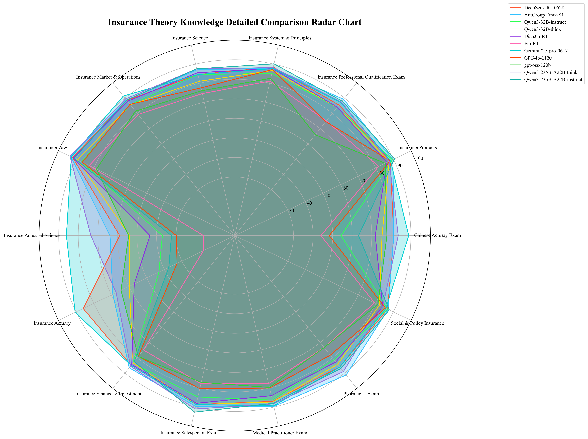
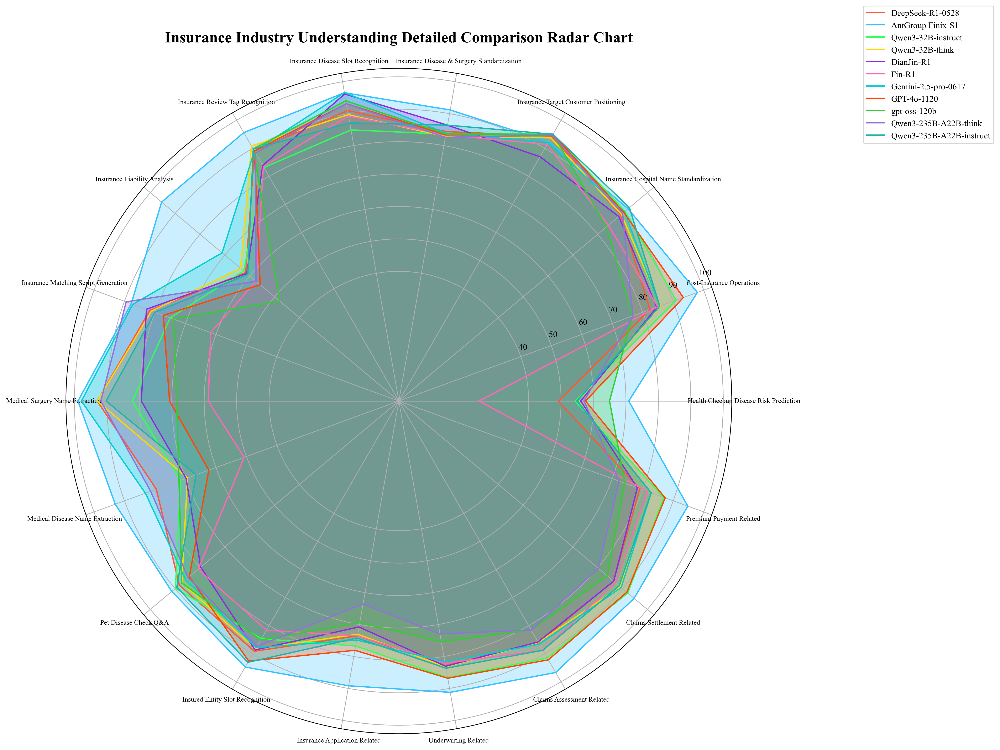
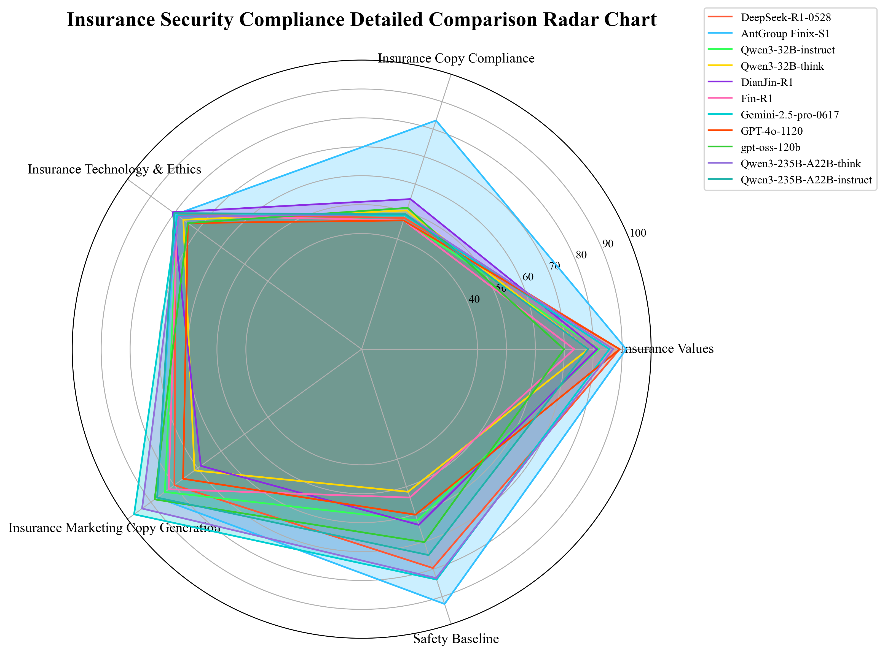
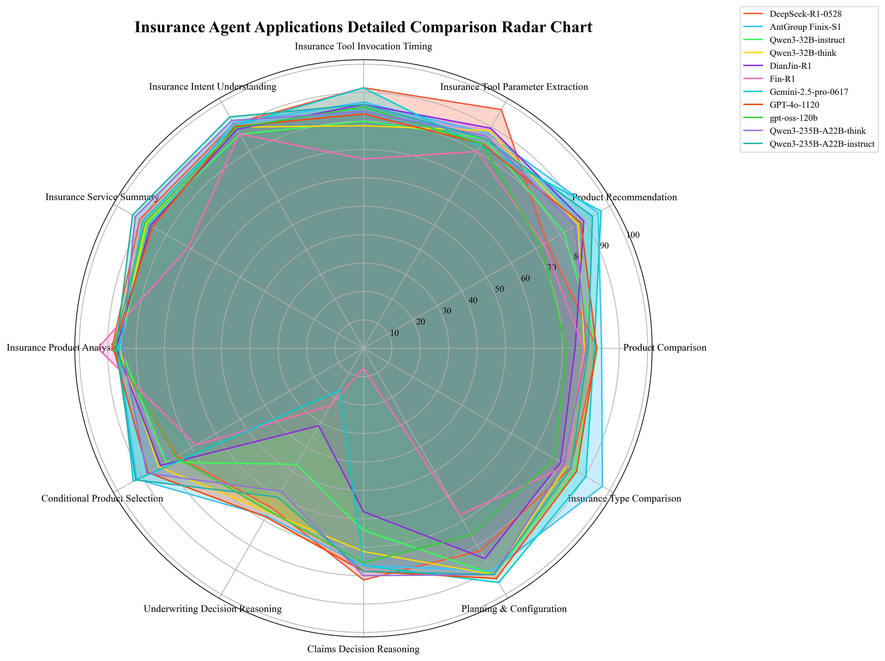
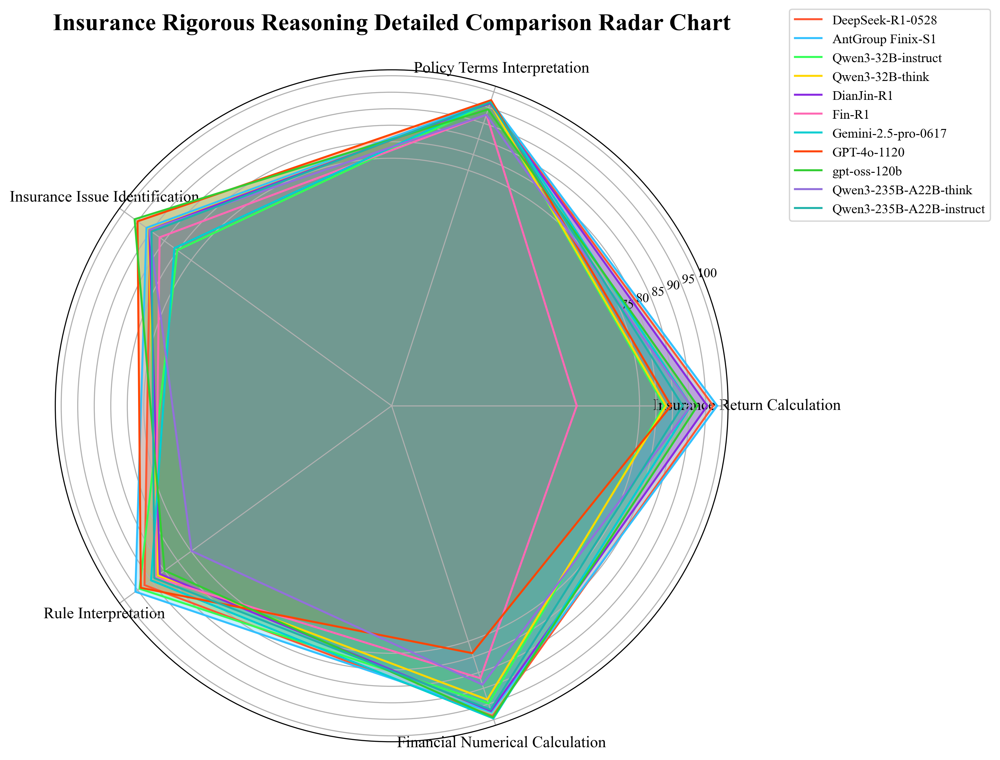
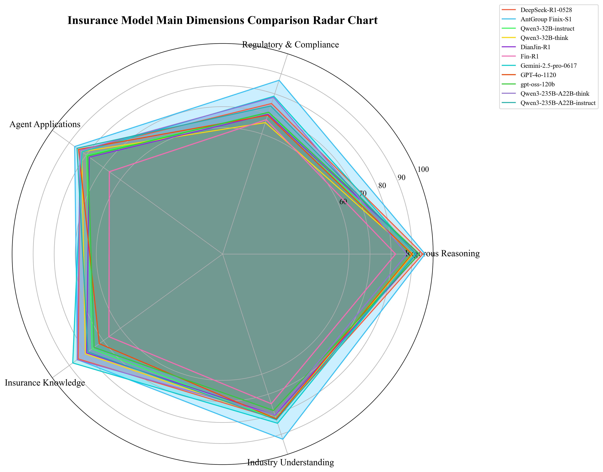

# CUFEInse v1.0 Large Language Model Capability Evaluation Report in the Insurance Domain

## Abstract
This report conducts a comprehensive assessment of the overall capabilities of 11 mainstream large language models (LLMs) in the insurance domain, based on the CUFEInse Insurance Foundation Benchmark (v1.0) publicly released by the School of Insurance at Central University of Finance and Economics (CUFE) and the China Institute forInstitute for Actuarial Science. The evaluation spans five core dimensions—Insurance Theoretical Knowledge, Industry Understanding, Safety & Compliance, Agentic Applications, and Logical Rigor—with a total of 54 fine-grained capability indicators.

The results show that high-quality, domain-specific training demonstrates clear advantages in vertical insurance scenarios. AntGroup Finix-S1 ranks first with an overall score of 89.51; Gemini-2.5-Pro-0617 (85.11) and DeepSeek-R1-0528 (84.20) rank second and third, respectively. Other models (the Qwen3 family, GPT-4o-1120, GPT-oss-120b, and DianJin R1-32B) exhibit distinct strengths and weaknesses, reflecting how different technical routes and training directions affect insurance-domain adaptation.

The evaluation also identifies common bottlenecks for current LLMs in professional scenarios such as **insurance actuarial analysis**, **underwriting and claims reasoning**, and **compliance of marketing copy**. We aim to provide evidence-based recommendations for model optimization and industry application.

# Ⅰ.Methodology
## 1.1 Composition of the Benchmark
CUFEInse v1.0 consists of 14,430 high-quality items, covering single choice, multiple choice, true/false, short answer, planning & reasoning, and complex Q&A. Questions were authored by experts from CUFE’s School of Insurance and the China Institute for Actuarial Science, and underwent cross-review and sensitivity audits to ensure professionalism and fairness.

## 1.2 Scope of Evaluated Models
This evaluation covers 11 representative models, including:
1. General closed-source models: Gemini-2.5-Pro-0617, GPT-4o-1120
2. General open-source models: DeepSeek-R1-0528, GPT-oss-120b, Qwen3-235B-A22B-instruct, Qwen3-235B-A22B-think, Qwen3-32B-instruct, Qwen3-32B-think
3. Domain models: AntGroup Finix-S1, DianJin-R1, Fin-R1

## 1.3 Scoring System
A "dimension-equal, subclass-balanced" comprehensive scoring strategy is adopted:

Equal weights across first-level dimensions, to avoid a single dimension dominating the overall score and to ensure comprehensive evaluation.

Balanced distribution across second-level subclasses by knowledge granularity, to ensure interpretability and comparability, and to clearly reflect capability differences in specific knowledge areas.

Final scores are standardized on a 100-point scale.

## 1.4 Model Information Table

| Model | Parameter Scale | Model Type | Open Source | Reasoning Ability |
|:--------|:--------|:--------|:--------|:--------|
| DeepSeek-R1-0528 | 671B | General | Yes | Supported |
| Qwen3-32B-instruct | 32B | General | Yes | Not Supported |
| Qwen3-32B-think | 32B | General | Yes | Supported |
| Qwen3-235B-A22B-instruct | 235B | General | Yes | Not Supported |
| Qwen3-235B-A22B-think | 235B | General | Yes | Supported |
| Gemini-2.5-pro-0617 | Unknown | General | No | Supported |
| GPT-4o-1120 | Unknown | General | No | Supported |
| GPT-oss-120b | 120B | General | Yes | Supported |
| AntGroup Finix-S1 | Unknown | Domain | No | Supported |
| DianJin-R1 | 32B | Domain | Yes | Supported |
| Fin-R1 | 7B | Domain-Specific | Yes | Supported |

# II. Detailed Evaluation
## 2.1 Theoretical Knowledge: Clear Stratification of Professional Depth; Reasoning Models Stand Out
The insurance theoretical knowledge dimension covers 14 fine-grained indicators across Insurance Studies, Insurance Products, Insurance Markets and Operations, Insurance Law, etc., to comprehensively assess a model’s mastery of foundational and professional knowledge in insurance.

Key findings:
1. Stratified professional depth: Gemini-2.5-Pro-0617 ranks first in this dimension with 88.00, showing outstanding performance in rigorous areas such as actuarial science (86.06). It is the only model scoring above 80 in the actuarial subcategory, indicating a strong reserve of professional knowledge.
2. Theoretical advantage of domain models: AntGroup Finix-S1 (85.28) ranks first in fine-grained areas such as Insurance Law (93.05) and Insurance Salesperson Examination (89.67), demonstrating broad coverage of cross-disciplinary insurance knowledge.
3. General weakness in actuarial depth: Most models perform poorly in actuarial topics—for example, GPT-4o-1120 (29.83), Qwen3-235B-A22B-Instruct (32.35), and Fin-R1 (15.98)—reflecting insufficient command of core quantitative knowledge for non-domain models.
4. Notable gains from reasoning mechanisms: "Reasoning" variants outperform their base counterparts; e.g., Qwen3-32B (think) exceeds Qwen3-32B (non-think) in actuarial science (53.79 vs. 37.01), suggesting that reasoning mechanisms help integrate specialized knowledge for long-form thinking and computational reasoning.

## 2.2 Industry Understanding: Domain Models Lead; Scenario Adaptation Is Key
The industry understanding dimension spans 18 business-scenario indicators, including target customer identification, coverage/liability analysis, underwriting & claims-related tasks, and medical terminology normalization (e.g., disease and procedure standardization), to evaluate a model’s grasp of practical business scenarios and process application capabilities.

Key findings:
1. Domain models lead across the board: AntGroup Finix-S1 tops this dimension with 92.47, ranking first in 13 of the 18 subcategories—particularly in insured-object slot identification (94.74), claims-related tasks (94.67), and post-issue servicing (97.92). It demonstrates end‑to‑end adaptability across the insurance value chain (purchase → underwriting → claims → post‑issue).
2. Divergence in medical insurance scenarios: AntGroup Finix-S1 performs strongly in medical-related tasks (e.g., disease/procedure standardization 91.16; medical condition name extraction 93.02). By contrast, other models generally score below 60 in disease risk prediction from medical examination reports, e.g., DeepSeek-R1-0528 at 49.15 and Gemini-2.5-Pro-0617 at 55.09.
3. Uneven coverage of business processes: Non-domain models show clear weaknesses in scenarios such as coverage/liability analysis (average 60.1).

## 2.3 Safety & Compliance: Overall Balanced; Marketing Copy Compliance Remains a Pain Point
The safety & compliance dimension includes five indicators—Insurance Technology & Ethics, Compliance of Insurance Marketing Copy, Safety Boundaries, Insurance Values, and Copy Compliance—to examine regulatory compliance, ethical boundary control, and risk avoidance in insurance services.

Key findings:
1. Compliance advantage of high-quality domain models: AntGroup Finix-S1 leads with 86.78, including strong performance on Safety Boundaries (92.67) and Insurance Copy Compliance (83.18), indicating that both copy compliance and value orientation align with regulatory expectations.
2. Marketing copy compliance as a pain point: Across all models, the highest score on Insurance Copy Compliance is only 83.18 (AntGroup), with a low of 46.83 (Fin-R1). Copy compliance is one of the major risk points when deploying AIGC in insurance marketing.
3. Deviation in value transmission: Qwen3-235B-A22B-Thinki (78.23) and DeepSeek-R1-0528 (75.17) are stable—excelling in Insurance Technology & Ethics (78.08) and Insurance Values (89.13), respectively—meeting compliance requirements. Some models inadequately convey the core value proposition of insurance as risk protection; e.g., Qwen3-32B (think) ranks last at 65.63, particularly low on Safety Boundaries (51.86), indicating potential compliance risks.

## 2.4 Agentic Applications: Layered Agent Capabilities; Decision-Making & Tool Use Vary Widely
This dimension covers 13 indicators including service summarization, product selection analysis, underwriting/claims decision-making reasoning, and product comparison, to evaluate practical agentic abilities such as intent understanding, decision-making reasoning, and tool invocation.

Key findings:
1. Layered agentic service capabilities: AntGroup Finix-S1 ranks first with 86.86, scoring highly on intent understanding (91.67), product type comparison (97.08), and product recommendation (95.35). It exhibits end‑to‑end intelligent service capabilities—understanding needs → analyzing products → recommending decisions → invoking tools.
2. Generally insufficient decision reasoning: Non-domain models perform poorly in underwriting and claims decision reasoning. For instance, Qwen3-235B-A22B-Instruct performs well in service summarization (93.84) but underperforms in underwriting decision reasoning (60.49); decision-making remains an area for improvement.
3. Divergent tool-use abilities: DeepSeek-R1-0528 ranks first in tool-parameter extraction (97.02) but is average on personalized tasks such as product recommendation (74.43). Fin-R1 and GPT-oss-120b show significant differences in product type comparison (82.55 vs. 77.64), indicating limited complexity and accuracy in intelligent services.

## 2.5 Logical Rigor: Numerical Computation and Clause Interpretation as Main Gaps
The logical rigor dimension includes five indicators—problem identification, insurance return rate calculation, policy clause interpretation, financial numerical computation, etc.—to examine logical analysis, numerical computation, and precise interpretation of policy terms.

Key findings:
1. Significant divergence in numerical computation: AntGroup Finix-S1 (96.15) leads in insurance return rate calculation (98.50) and rule information interpretation (95.86), achieving accurate calculations and nuanced understanding of exclusions and coverage scope in policy clauses, with low logical error rates.
2. Generally good problem identification: GPT-oss-120b performs strongly in insurance-related problem identification (96.16), accurately recognizing insurance-related issues—showing that general models can still be robust in foundational logical judgment. DianJin-R1 (90.66) is also excellent, suggesting that capabilities in the financial domain transfer to insurance logical rigor.

# III. Overall Conclusions and Recommendations
## 3.1 Overall Ranking and Analysis

Based on composite scores, the evaluated models fall into three tiers:
1. Tier 1 (>85): AntGroup Finix-S1 (89.51), Gemini-2.5-Pro-0617 (85.11)
2. Tier 2 (80–85): DeepSeek-R1-0528 (84.20), Qwen3-235B-A22B-think (83.03), Qwen3-235B-A22B-instruct (82.66), DianJin-R1 (80.35), Qwen3-32B-think (80.34)
3. Tier 3 (<80): Qwen3-32B-instruct (79.87), GPT-4o-1120 (79.71), GPT-oss-120b (79.41), Fin-R1 (71.46)

- 🟢 90-100 points: excellent
- 🟠 80-89 points: good
- 🟡 70-79 points: normal
- 🔴 0-69 points: needs improvement

| Model ID | Total Score | Insurance Theory Knowledge | Insurance Industry Understanding | Insurance Security Compliance | Insurance Agent Applications | Insurance Rigorous Reasoning |
|:--------|:--------:|:--------:|:--------:|:--------:|:--------:|:--------:|
| **AntGroup Finix-S1** 🥇 | 89.51 | 🟠 85.28 | 🟢 92.47 | 🟠 86.78 | 🟠 86.86 | 🟢 96.15 |
| **Gemini-2.5-pro-0617** 🥈 | 85.11 | 🟠 88.00 | 🟠 84.52 | 🟡 78.80 | 🟠 82.55 | 🟢 91.69 |
| **DeepSeek-R1-0528** 🥉| 84.20 | 🟠 84.75 | 🟠 82.27 | 🟡 75.17 | 🟠 83.75 | 🟢 95.07 |
| **Qwen3-235B-A22B-think** | 83.03 | 🟠 85.42 | 🟠 80.30 | 🟡 78.23 | 🟠 83.69 | 🟠 87.52 |
| **Qwen3-235B-A22B-instruct** | 82.66 | 🟡 79.07 | 🟠 82.75 | 🟡 73.93 | 🟠 85.52 | 🟢 92.04 |
| **DianJin-R1** | 80.35 | 🟡 79.88 | 🟠 80.47 | 🔴 69.82 | 🟡 78.25 | 🟢 93.30 |
| **Qwen3-32B-think** | 80.34 | 🟠 80.62 | 🟠 82.48 | 🔴 65.63 | 🟠 82.68 | 🟢 90.28 |
| **Qwen3-32B-instruct** | 79.87 | 🟡 76.61 | 🟠 82.37 | 🟡 70.80 | 🟡 79.90 | 🟠 89.65 |
| **GPT-4o-1120** | 79.71 | 🟡 72.42 | 🟠 82.28 | 🔴 69.33 | 🟠 84.58 | 🟠 89.92 |
| **gpt-oss-120b** | 79.41 | 🟡 75.47 | 🟡 78.16 | 🟡 70.82 | 🟡 79.14 | 🟢 93.46 |
| **Fin-R1** | 71.46 | 🔴 66.77 | 🟡 74.76 | 🔴 67.09 | 🔴 66.52 | 🟠 82.16 |

## 3.2 Key Findings and Insights
Distinct advantages of high-quality domain models: AntGroup Finix-S1 (Ant Insurance LLM) ranks first overall with 89.51, placing first in four of the five dimensions and third in insurance theoretical knowledge. This shows the positive impact of high-quality domain adaptation training for insurance LLMs.

General models show highlights but lack full coverage: Gemini-2.5-Pro-0617 (general model) ranks first in insurance theoretical knowledge, demonstrating the breadth advantage of general models. However, it scores lower in Agentic Applications (82.55) and Safety & Compliance (78.80), reflecting strong general ability but insufficient domain adaptation in some aspects.

Validated value of reasoning mechanisms: For the same base model, the "reasoning" version outperforms the "non-reasoning" version in Insurance Theory and Logical Rigor, proving that reasoning mechanisms effectively enhance integration of specialized knowledge for complex reasoning tasks and multi-step calculations in insurance.

Identified cross-model bottlenecks: Scores are generally low in core professional areas. Actuarial science, underwriting and claims decision-making, and marketing copy compliance emerge as three common bottlenecks. Non-domain models show shortfalls in end-to-end business adaptation and in niche tasks such as risk prediction from medical examination reports, requiring targeted optimization.

## 3.3 Recommendations
For domain models: Focus on deepening actuarial expertise; enrich datasets for specialized lines (e.g., pet insurance, agricultural insurance) to reinforce the "full-scenario + high expertise" advantage.

For non-domain models: Enhance scenario-based training across the full insurance process (purchase → underwriting → claims); strengthen cross-domain knowledge fusion in Insurance + Healthcare and Insurance + Actuarial Science to improve domain adaptation.

For open-source models: Provide fine-tuning datasets for the insurance domain (particularly actuarial and underwriting/claims scenarios), thereby lowering adaptation barriers and fostering the open-source insurance LLM ecosystem.

For weaker models: Start with building a solid foundation in insurance theory; prioritize supplementation in actuarial science and compliance/value orientation; progressively extend to business scenarios, achieving stepwise improvement from fundamentals to applications.

## IV. Outlook
This evaluation not only objectively reflects the current capabilities of LLMs in the insurance domain but also indicates directions for future development. The CUFEInse benchmark will continue to iterate, gradually incorporating new dimensions such as multimodal capability evaluation and real-time regulatory policy adaptability assessment, thereby supporting the digital transformation of the insurance industry.

We believe that, with ongoing optimization of domain models and improved domain adaptation of general models, LLMs will bring greater value across the full insurance lifecycle—product design, precision marketing, intelligent underwriting, and claims services—ultimately driving insurance services toward higher levels of intelligence, personalization, and efficiency.

The School of Insurance at CUFE and the China Institute for Actuarial Science will continue to uphold openness and collaboration, welcoming both industry and academia to participate in the iteration and refinement of the CUFEInse benchmark and to jointly promote the prosperity of the insurtech ecosystem.

---

Publication Date: August 2025

Project Pages: [GitHub](https://github.com/CUFEInse/CUFEInse.git) | [HuggingFace](https://huggingface.co/datasets/CUFEInse/CUFEInse)

Issuing Organizations: School of Insurance, Central University of Finance and Economics (CUFE); China Institute for Actuarial Science

Contact Email: [cufeinse@cufe.edu.cn](mailto:cufeinse@cufe.edu.cn)

