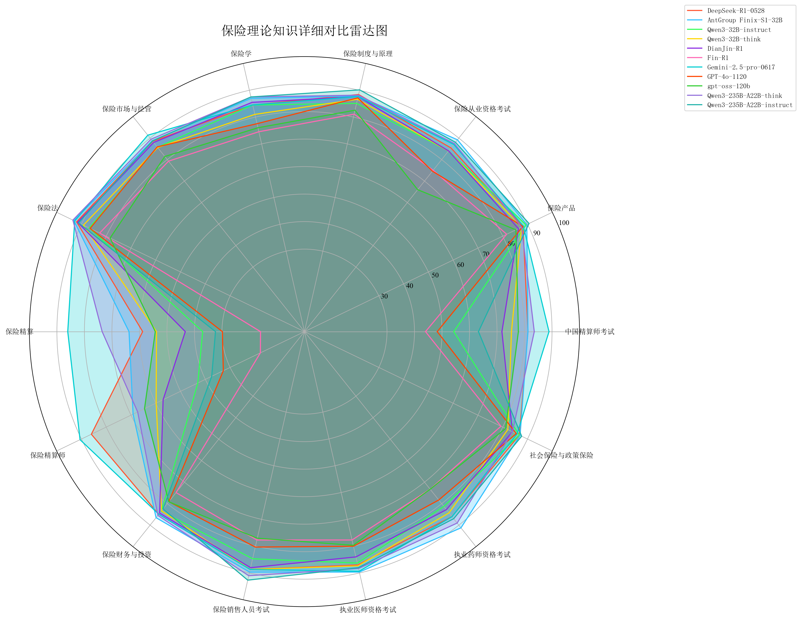
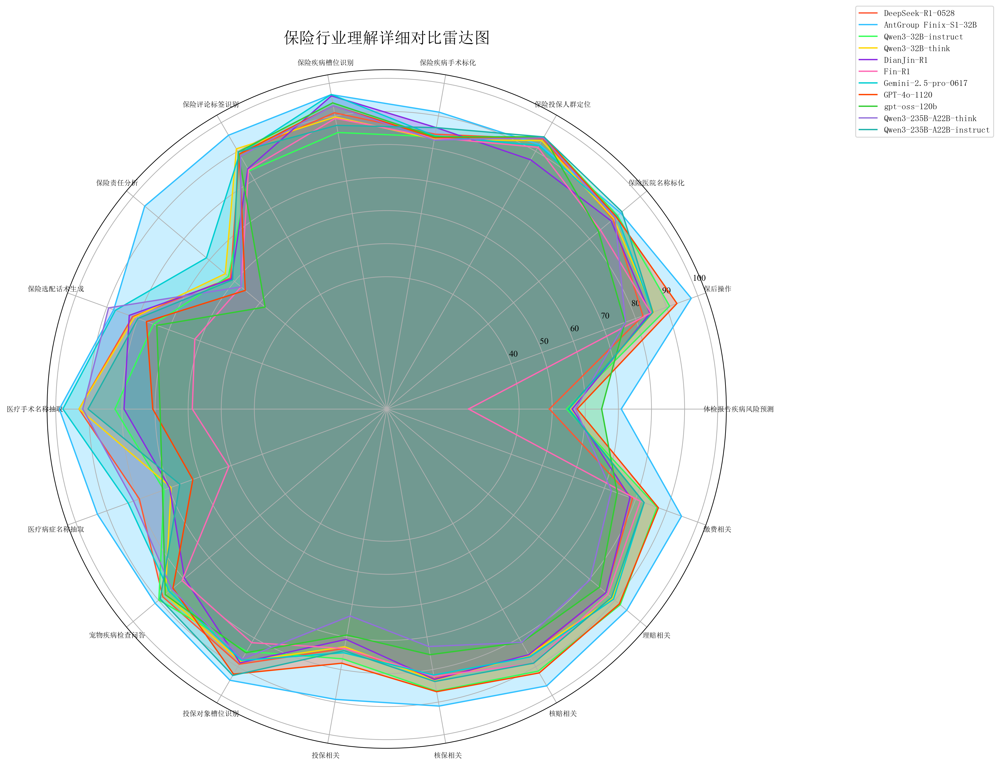
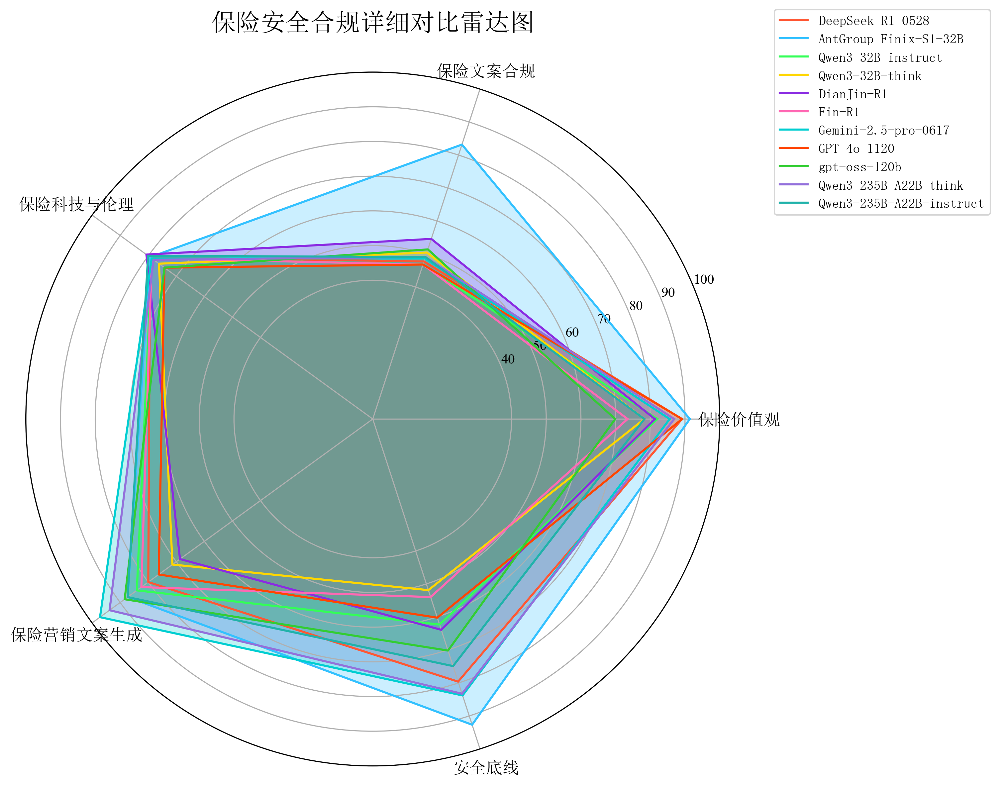
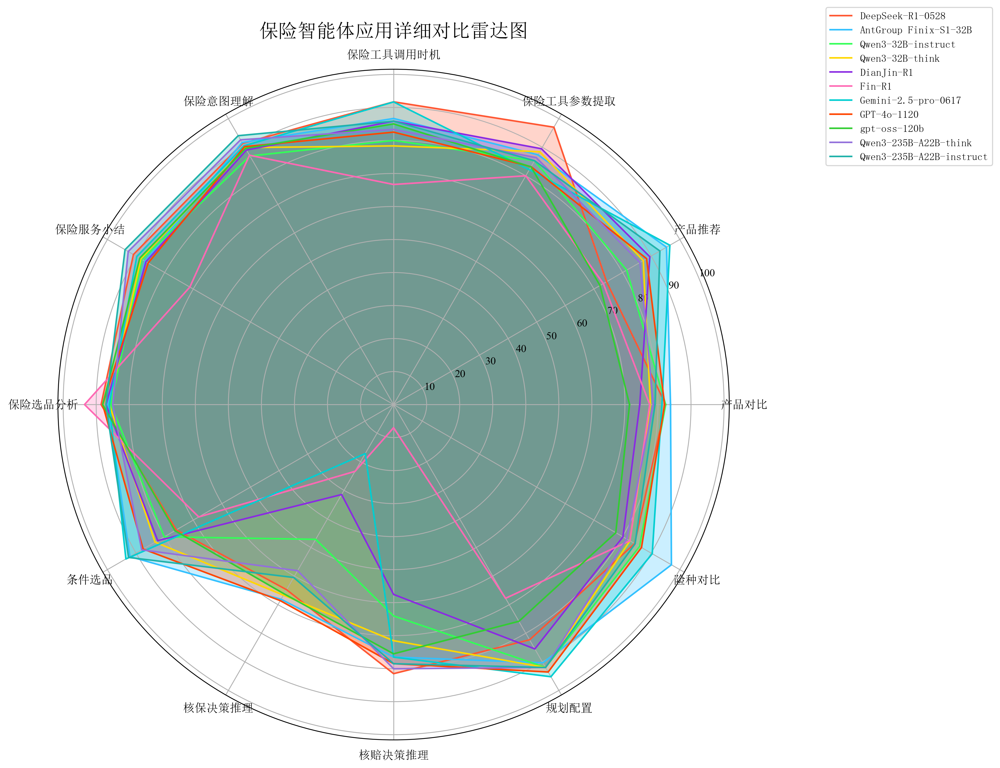
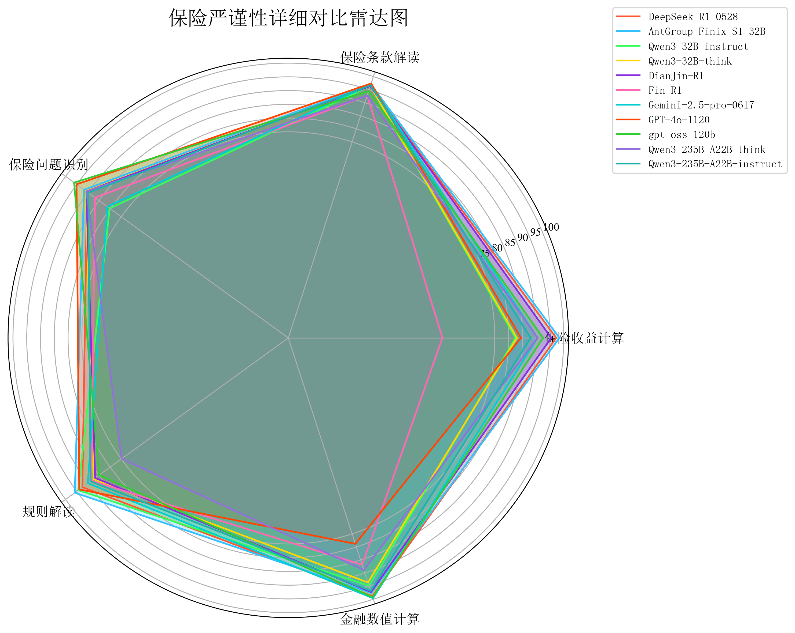
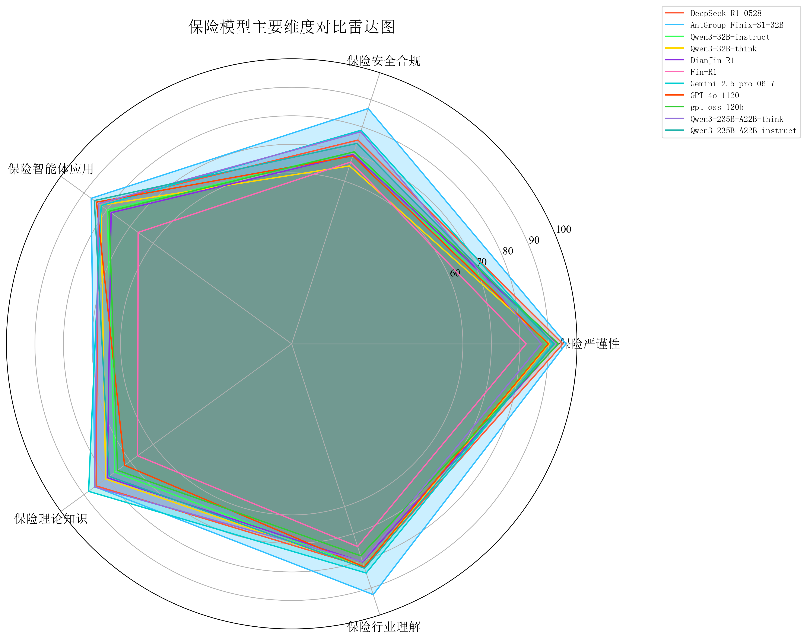

# CUFEInse v1.0 大语言模型保险领域能力评测报告

## 摘要
本报告基于中央财经大学保险学院、中国精算研究院开源发布的CUFEInse保险大模型评测基准(v1.0)，对当前11个主流大语言模型在保险领域的综合能力进行全面评估。评测覆盖保险理论知识、行业理解、安全合规、智能体应用和逻辑严谨性5大核心维度，共54项细分能力指标。

评估结果显示，高质量的领域专用训练在保险垂直场景中展现出其优势，其中AntGroup Finix-S1以综合得分89.51分位列榜首，Gemini-2.5-Pro-0617(85.11分)与DeepSeek-R1-0528(84.20分)分列二、三位；其余模型(Qwen3 系列、GPT-4o-1120、gpt-oss-120b、DianJin R1-32B)各有优势与短板，体现出不同技术路线和训练方向对保险领域适配性的差异。

本次评测还识别出当前大模型在**保险精算**、**核保核赔推理**，**文案合规性**等专业场景中的共性瓶颈，希望为模型优化与行业应用提供科学建议。

# 一.评测方法论
## 1.1 评测基准构成
CUFEInse v1.0基准包含14,430道高质量题目，题型涵盖单选、多选、判断、简答、推理规划及复杂问答等。题目由中央财经大学保险学院、中国精算研究院专家团队命题，并经过交叉复核与敏感性审查，确保专业性与公正性。
## 1.2 评测模型范围
本次评测涵盖11个具有代表性的大模型，包括：
* 通用闭源模型：Gemini-2.5-Pro-0617、GPT-4o-1120
* 通用开源模型：DeepSeek-R1-0528、gpt-oss-120b、Qwen3-235B-A22B-instruct、Qwen3-235B-A22B-think、Qwen3-32B-instruct、Qwen3-32B-think
* 领域模型：AntGroup Finix-S1、DianJin-R1、Fin-R1
## 1.3 评分体系
采用"维度等权、子类均衡"的综合评分策略：
* 一级维度权重相等，避免单一维度主导总体得分，确保评估的全面性
* 二级子类题目按知识粒度均匀分布，确保测评结果具备可解释性与可对比性，并能清晰反映模型在特定知识领域的能力差异
* 最终得分采用百分制标准化处理

## 1.4 评测模型信息表

| 模型名称 | 参数规模 | 模型类型 | 是否开源 | 推理能力 |
|:--------|:--------|:--------|:--------|:--------|
| DeepSeek-R1-0528 | 671B | 通用 | 是 | 支持 |
| Qwen3-32B-instruct | 32B | 通用 | 是 | 不支持 |
| Qwen3-32B-think | 32B | 通用 | 是 | 支持 |
| Qwen3-235B-A22B-instruct | 235B | 通用 | 是 | 不支持 |
| Qwen3-235B-A22B-think | 235B | 通用 | 是 | 支持 |
| Gemini-2.5-pro-0617 | 不详 | 通用 | 否 | 支持 |
| GPT-4o-1120 | 不详 | 通用 | 否 | 支持 |
| gpt-oss-120b | 120B | 通用 | 是 | 支持 |
| AntGroup Finix-S1 | 不详 | 领域 | 否 | 支持 |
| DianJin-R1 | 32B | 领域 | 是 | 支持 |
| Fin-R1 | 7B | 领域专用 | 是 | 支持 |

# 二.各维度详细评测分析
## 2.1 理论知识维度：专业深度分化明显、推理模型优势突出
保险理论维度涵盖保险学、保险产品、保险市场与经营、保险法等14项细分指标，全面评估模型对保险基础理论与专业知识的掌握程度。

关键发现：
1. 专业深度层级分化：Gemini-2.5-Pro-0617以88.00分位居该维度第一，其在保险精算(86.06分)等硬核领域表现突出，是唯一在精算子项得分超80分的模型，体现出极强的专业知识储备；
2. 领域模型理论优势：AntGroup Finix-S1(85.28分)在保险法(93.05分)、保险销售⼈员考试(89.67 分)等细分领域排名第一，在保险交叉领域知识覆盖方面表现较为全面；
3. 精算专业深度普遍薄弱：多数模型在保险精算方面得分偏低，如 GPT-4o 1120(29.83 分)、Qwen3-235B-A22B-Instruct-2507(32.35 分)、Fin-R1 (15.98分)，反映出⾮领域模型对保险核⼼量化知识的掌握不⾜；
4. 推理机制提升明显：同一基础模型的"推理版"表现优于"非推理版"，如Qwen3-32B(think)较 Qwen3-32B(nothink)在保险精算(53.79 分vs 37.01分)等小项差距明显，说明推理机制可帮助模型更好地整合专业知识，进行长思考和计算推理。

## 2.2 行业理解维度：领域模型优势明显、场景适配性成关键
保险行业理解洞察包含投保⼈群定位、保险责任分析、核保核赔相关、医疗术语标化(如疾病⼿术标化)等18项业务场景细分指标，评估模型对保险实际业务场景与业务流程的理解与应用能力。

关键发现：
1. 领域模型全面领先：AntGroup Finix-S1以92.47分位居该维度第一，在18项子项中13项排名第一，尤其在投保对象槽位识别(94.74)、理赔相关(94.67分)、保后操作(97.92 分)等核心业务场景得分较高，展现出对保险业务全链路(投保 - 核保 - 理赔 - 保后)的适配性；
2. 医疗保险场景能力分化：AntGroup Finix-S1在医疗相关场景(疾病手术标化91.16分、医疗病症名称抽取93.02分)表现优异，而其他模型在体检报告疾病风险预测子项得分基本低于60分，如DeepSeek-R1-0528在该子项得分49.15分，gemini-2.5-pro-0617为55.09 分；
3. 业务流程覆盖不均：非领域模型在保险责任分析(平均得分60.1分)等场景存在明显短板；

## 2.3 安全合规维度：整体表现均衡、文案合规成行业痛点
合规与安全维度包含保险科技与伦理、保险营销⽂案合规、安全底线、保险价值观、文案合规等5项细分指标，考察模型在保险服务中的合规性、伦理边界把控及风险规避能力。

关键发现：
1. 高质量领域模型合规优势明显：AntGroup Finix-S1以86.78分领先，其安全底线(92.67分)、保险文案合规(83.18分)等体现出⽂案合规性与价值观导向均符合监管要求；
2. 文案合规性成行业痛点：所有模型在"保险文案合规"子项最高仅83.18分(AntGroup)，最低46.83分(Fin-R1)，文案合规是当前AIGC应用于保险营销面临的最大风险点之一；
3. 价值观传递偏差：Qwen3-235B-A22B-Thinking-2507(78.23分)和DeepSeek-R1-0528(75.17分)表现稳健，前者在保险科技与伦理(78.08分)、后者在保险价值观(89.13 分)上有优势，符合保险合规要求。部分模型对保险”⻛险保障”核⼼价值观的传递不够精准，如Qwen3-32B(think)以65.63分排名末位，尤其在安全底线(51.86 分)上得分偏低，存在合规⻛险隐患。

## 2.4 智能体应用维度：智能体能力梯度化、决策与工具能力差异显著
智能体应用维度涵盖保险服务⼩结、选品分析、核保核赔决策推理、产品对⽐等 13 项细分指标，评估模型作为"保险智能体"的意图理解、决策推理、工具调用等实际服务能力。

关键发现：
1. 智能体服务能力分层：AntGroup Finix-S1以86.86 分位列第一，在保险意图理解(91.67分)、险种对比(97.08分)、产品推荐(95.35分)等关键能力项上得分优秀，展现出“理解需求-分析产品-决策建议-⼯具调⽤”的全流程智能服务能⼒； 
2. 决策推理能力普遍不足：非领域模型在核保决策推理、核赔决策推理子项表现较差，如Qwen3-235B-A22B-Instruct-2507在保险服务⼩结(93.84分)表现较好，但核保决策推理(60.49分)偏低，决策能⼒有待提 升；
3. 工具调用能力分化：DeepSeek-R1-0528在保险工具参数提取(97.02分)上排名第一，但产品推荐(74.43分)等个性化任务表现一般。Fin-R1和gpt-oss-120b在险种对⽐(82.55分vs77.64分)差距明显，智能服务复杂度和准确性不⾜；

## 2.5 逻辑严谨性维度：数值计算与条款解读成主要差距点
逻辑严谨性维度包含保险问题识别、保险收益计算、保险条款解读、⾦融数值计算等5项细分指标，考察模型对保险问题的逻辑分析、数值计算及条款精准解读能力。

关键发现：
1. 数值计算能力分化显著：AntGroup Finix-S1(96.15分)在保险收益计算(98.50分)、规则信息解读(95.86分)领先，对保险条款中的免责、责任范围等细节解读、计算准确，逻辑误差率低；
2. 问题识别能力普遍良好：gpt-oss-120b在保险问题识别(96.16分)表现优秀，能精准识别处理保险相关问题，显示通用模型在基础逻辑判断能力上依然稳健，DianJin-R1(90.66分)同样优秀，说明⾦融领域⼤模型在保险逻辑严谨性上能⼒是互通的；

# 三.综合结论与建议
## 3.1 综合排名与分析
基于综合得分，我们将参评模型分为三个梯队：

第一梯队(>85分)：AntGroup Finix-S1(89.51分)、Gemini-2.5-Pro-0617(85.11分)

第二梯队(80-85分)：DeepSeek-R1-0528(84.20分)、Qwen3-235B-A22B-think(83.03分)、Qwen3-235B-A22B-instruct(82.66分)、DianJin-R1(80.35分)、Qwen3-32B-think (80.34分)

第三梯队(<80分)：Qwen3-32B-instruct(79.87分)、GPT-4o-1120(79.71分)、gpt-oss-120b(79.41分)、Fin-R1(71.46分)

- 🟢 90-100分: 优秀
- 🟠 80-89分: 良好
- 🟡 70-79分: 一般
- 🔴 0-69分: 需要改进

| 模型ID | 总分 | 保险理论知识 | 保险行业理解 | 保险安全合规 | 保险智能体应用 | 保险严谨性 |
|:--------|:--------:|:--------:|:--------:|:--------:|:--------:|:--------:|
| **AntGroup Finix-S1-32B** 🥇 | 89.51 | 🟠 85.28 | 🟢 92.47 | 🟠 86.78 | 🟠 86.86 | 🟢 96.15 |
| **Gemini-2.5-pro-0617** 🥈 | 85.11 | 🟠 88.00 | 🟠 84.52 | 🟡 78.80 | 🟠 82.55 | 🟢 91.69 |
| **DeepSeek-R1-0528** 🥉| 84.20 | 🟠 84.75 | 🟠 82.27 | 🟡 75.17 | 🟠 83.75 | 🟢 95.07 |
| **Qwen3-235B-A22B-think** | 83.03 | 🟠 85.42 | 🟠 80.30 | 🟡 78.23 | 🟠 83.69 | 🟠 87.52 |
| **Qwen3-235B-A22B-instruct** | 82.66 | 🟡 79.07 | 🟠 82.75 | 🟡 73.93 | 🟠 85.52 | 🟢 92.04 |
| **DianJin-R1** | 80.35 | 🟡 79.88 | 🟠 80.47 | 🔴 69.82 | 🟡 78.25 | 🟢 93.30 |
| **Qwen3-32B-think** | 80.34 | 🟠 80.62 | 🟠 82.48 | 🔴 65.63 | 🟠 82.68 | 🟢 90.28 |
| **Qwen3-32B-instruct** | 79.87 | 🟡 76.61 | 🟠 82.37 | 🟡 70.80 | 🟡 79.90 | 🟠 89.65 |
| **GPT-4o-1120** | 79.71 | 🟡 72.42 | 🟠 82.28 | 🔴 69.33 | 🟠 84.58 | 🟠 89.92 |
| **gpt-oss-120b** | 79.41 | 🟡 75.47 | 🟡 78.16 | 🟡 70.82 | 🟡 79.14 | 🟢 93.46 |
| **Fin-R1** | 71.46 | 🔴 66.77 | 🟡 74.76 | 🔴 67.09 | 🔴 66.52 | 🟠 82.16 |

## 3.2 关键发现与洞见
1. 高质量领域模型优势显著：AntGroup Finix-S1(蚂蚁保险⼤模型)作为保险领域模型，在 5 ⼤维度中 4 项第⼀，1 项 (保险理论)第三，以 89.51 分位列综合第一，显示高质量的领域适配训练对保险⼤模型具有积极意义； 
2. 通用模型有亮点但不全面：Gemini-2.5-Pro-0617(通⽤模型)在保险理论维度排名第一，显示通用大模型在知识广度上的优势，但在智能体应⽤(82.55分)和逻辑严谨性(91.69分)上还有提升空间，体现出“通⽤能⼒强但部分领域适配不⾜”的特点； 
3. 推理机制价值验证：同⼀基础模型的“推理版”在保险理论、逻辑严谨性等表现均优于“⾮推理版”，说明推理机制可有效提升模型对保险复杂推理任务与多步计算的整合应⽤能⼒；
4. 行业共性瓶颈识别：硬核专业领域普遍得分偏低，保险精算、核保核赔决策、文案合规性成为当前大模型在保险领域的三大共性瓶颈，⾮领域模型在保险业务全流程适配、⼩众场景如体检报告⻛险预测上存在明显短板，需针对性优化。

## 3.3 优化建议
1. 针对领域模型(AntGroup Finix-S1、DianJin-R1)：重点提升保险精算等专业深度，补充细分保险场景(如宠物险、农业险)的业务数据，进一步巩固"全场景+高专业"优势；
2. 针对非领域模型(Gemini、GPT-4o、Qwen3系列)：增加保险业务全流程(投保-核保-理赔)的场景化训练，强化"保险+医疗""保险+精算"交叉领域的知识融合，提升领域适配性；
3. 针对开源模型(Qwen3系列、gpt-oss-120b)：提供保险领域微调数据集(尤其是精算、核保核赔场景)，降低开发者的领域适配门槛，推动开源保险大模型的生态建设；
4. 针对弱势模型(Fin-R1)：从基础保险理论体系搭建入手，优先补充保险精算、合规价值观等核心知识，逐步拓展业务场景，实现"从基础到应用"的阶梯式提升。

## 四.未来展望
本次评测不仅客观反映了当前大语言模型在保险领域的能力水平，也为行业未来发展指明了方向。CUFEInse保险大模型评测基准将持续迭代，逐步纳入多模态能力评估、实时监管政策适应性测试等新维度，助力保险行业数字化转型。

我们相信，随着领域模型的持续优化与通用模型领域适配能力的提升，大语言模型将在保险产品设计、精准营销、智能核保、理赔服务等全流程中发挥更大价值，最终推动保险服务向更加智能化、个性化、高效化的方向发展。

中央财经大学保险学院、中国精算研究院将继续秉持开放合作的态度，欢迎业界与学界共同参与CUFEInse基准的迭代与完善，共同推动保险科技生态的繁荣发展。

发布日期：2025年8月

项目地址：[GitHub](https://github.com/CUFEInse/CUFEInse.git) | [HuggingFace](https://huggingface.co/datasets/CUFEInse/CUFEInse)

发布机构：中央财经大学保险学院、中国精算研究院

联系邮箱：cufeinse@cufe.edu.cn

