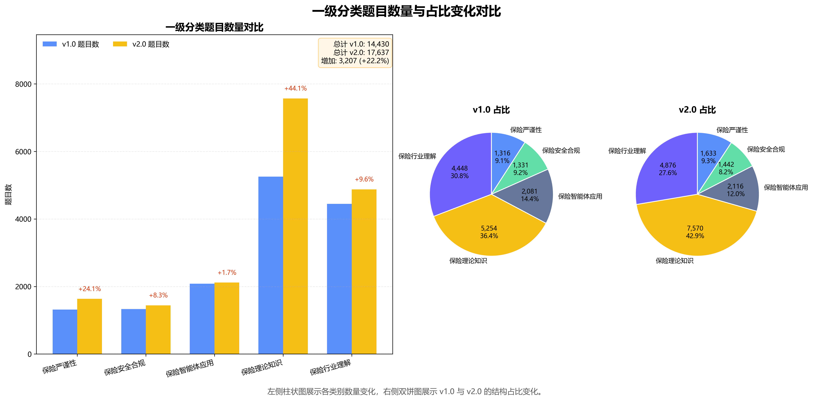
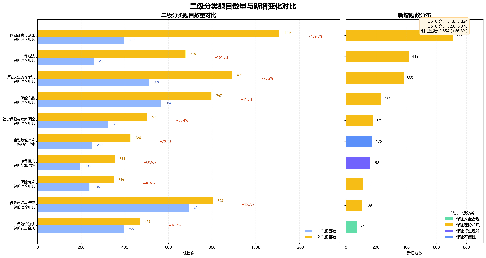

<div align="center">

<h1 style="font-size: 48px; color: #2c3e50; margin: 20px 0; font-weight: bold;">CUFEInse v2.0</h1>

<p style="font-size: 22px; color:rgb(0, 0, 0); margin: 10px 0 20px 0; font-weight: 900; letter-spacing: 1px;">中央财经大学 Insurance Evaluation Suite</p>
<p style="font-size: 22px; color:rgb(0, 0, 0); margin: 10px 0 20px 0; font-weight: 900; letter-spacing: 1px;">全球首个保险大模型专业评估体系</p>

[](https://creativecommons.org/licenses/by/4.0/)


---

**版本** v2.0

**📖 文档** · [简体中文](../../README.md) · [English](./README_EN.md)

**📜 历史版本** · [v1.0 文档](../v1/README_zh_CN.md) · [v1.0 测评报告](../v1/report_v1_zh_CN.md) · [v1.0 README](../v1/README.md)

</div>

---
## 目录
* [背景与迭代意义](#背景与迭代意义)
* [v2.0 测评体系构建方法论](#测评体系构建方法论)
* [v2.0 版本核心升级与技术创新](#核心升级与技术创新)
* [测评数据集详细分布](#测评数据集详细分布)
* [测评集使用规范与评分机制](#测评集使用规范与评分机制)
* [开源方案与抽样设计](#开源方案与抽样设计)
* [联系我们](#联系我们)

---

## 背景与迭代意义

2025年9月，中央财经大学保险学院、中国精算研究院发布CUFEInse v1.0保险领域评测基准，作为全球首个深度融合保险学科体系、全面覆盖保险专业理论与产业应用场景的大模型评测基准，1.0 版本收录**14,430**道高质量题目，构建覆盖5大一级维度、54个二级子类的标准化测评体系，填补保险领域大模型系统性专业评估的空白，获得学界、保险行业与科技企业的广泛应用与认可。

随着大模型在保险行业的深度落地，产业端对模型的专业知识精度、逻辑推理严谨性、合规安全把控能力、全场景落地适配性提出了更高要求；同时基于v1.0半年的应用实践，我们收集到来自诸多高校、保险机构、科技企业的反馈，发现评测体系在题库覆盖广度、计算能力评估精度、细分险种场景适配性、题目分类规范性等方面仍有优化空间。

基于此，我们完成了CUFEInse v2.0的全体系迭代升级。新版本延续v1.0"**学科为本、专家驱动、贴合产业**"的核心定位，在题库规模、质量管控、能力评估维度、场景适配性等方面实现全面突破，旨在打造更贴合保险学科体系、更适配产业落地需求、更具技术权威性的保险大模型评测基准，持续引领保险领域大模型评估标准的建设与完善。

## 测评体系构建方法论

CUFEInse v2.0在v1.0"定量为主、专家驱动、多重校验" 核心方法论的基础上，升级为全流程闭环质量管控体系，历经五大核心环节完成全量数据集的构建与迭代，确保数据集的专业性、严谨性与场景适配性：

- **1. 行业需求与应用反馈调研**
面向高校科研单位、保险企业与中介机构、金融科技企业开展深度调研与深度访谈，梳理v1.0使用中的核心痛点与产业落地的新需求，明确"强化计算能力评估、扩充核心学科题库、补充细分险种场景、优化分类边界"**四大迭代核心方向**。

- **2. 专家命题与题库扩充**
组织中央财经大学保险学院、中国精算研究院专任教师、行业资深精算师、合规专家、保险科技业务专家，基于保险学科完整体系与保险全业务流程场景，完成新增题目命题与原有题库的扩充，新增题目覆盖保险核心理论、精算计算、合规安全、核保核赔等全维度内容，确保题目专业性与产业贴合度。

- **3. 四级交叉复核与修订**
建立"命题人初审-学科专家交叉复核-行业专家场景校验-合规专家审查"的四级复核机制，对全量题目（含原有题目与新增题目）进行逐一修订，修正v1.0中存在的表述歧义、分类优化、答案精度不足等问题，确保**题目零歧义、答案零错误**。

- **4. 敏感性与合规性审查**
联合保险监管领域专家，对全量题目进行合规性、敏感性双重审查，确保所有题目完全符合国家金融监督管理总局监管机构发布的保险行业监管要求，杜绝不合规表述与敏感内容，贴合保险行业强监管、高风险敏感的核心特性。

- **5. 全量数据质量校验**
通过AI格式校验+人工审核双重方式，对全量题目进行格式一致性、内容完整性、唯一性校验，剔除高度相似性题目，确保数据集的高质量与唯一性。

本次迭代核心数据指标如下：

| 📊 指标项 | 🔢 数值 | 📝 说明 |
| :--- | :---: | :--- |
| **v1.0 基准题库量** | **14,430** | 1.0 版本全量题目 |
| 新增入库题目量 | 3,207 | 新增题目去重后有效入库量 |
| 修订题目量 | 239 | 优化与更新表述与答案的题目量 |
| 去重题目量 | 11 | 全量题库核查剔除高度相似性题目 |
| **v2.0 全量题库量** | **17,637** | 最终发布的全量测评题目总数 |

## 核心升级与技术创新

CUFEInse v2.0在v1.0基础上实现了四大核心维度的全面升级，进一步强化了评测基准的技术性、专业性与产业适配性，核心创新点如下：

- **1. 题库规模大幅扩充，学科覆盖深度实现质的飞跃**
v2.0全量题目达**17,637**道，较v1.0的**14,430**道整体规模扩充**22.2%**，是目前全球规模最大、知识点覆盖最全的保险领域专业评测基准。
    - **核心学科重点强化**：本次扩充的核心板块为保险理论知识维度，新增题目2316道，总量从5254道提升至7570道，占比从38.18%提升至43.42%，重点扩充了保险制度与原理、保险法、保险产品、保险精算等保险学科核心领域的题目，进一步夯实了评测基准的学科专业性，构建了更完整的保险学科知识评估体系。
    - **细分险种全面覆盖**：针对v1.0中细分险种覆盖不足的问题，在保险产品、险种对比、责任分析等二级分类中，补充了健康险、意外险、责任险、农险、信用保证保险等细分小险种的专属题目，充实细分场景的评估薄弱部分，大幅提升垂直险种场景的评测价值，能够更精准地评估模型在细分险种中的落地能力。

- **2. 全流程质量管控体系升级，数据精度与分类严谨性全面优化**
v2.0建立了全闭环的质量管控体系，实现了从需求调研到最终发布的全流程质量把控，核心成果包括：
    - 通过四级复核机制完成全量题目的修订优化，实现题目表述更科学、标准答案更精准，大幅提升了测评结果的客观性与可重复性。
    - 完成全量题目合规性与敏感性双重审查，确保所有题目符合保险行业监管要求，进一步强化了评测基准的合规性与权威性。

- **3. 核心能力评估体系全面强化，精准匹配保险精算与产业落地需求**
针对全行业在v1.0评测集使用中向团队反馈的大模型计算与合规能力不足的痛点，2.0版本重点强化了三大核心能力的评估维度，构建了更贴合保险业务实际需求评估体系：
    - **核心精算能力评估深度升级**：保险严谨性分类下的金融数值计算二级分类，题量占比从19.00%提升至26.09%，是分类增长最显著的板块；同时保险精算二级分类题目新增 111 道。新增计算类题目覆盖保险收益计算、精算定价、准备金计提、赔付限额计算等全业务流程核心场景，题型从简单数值计算升级为多步骤逻辑推理计算，能够更精准地评估大模型在保险场景下的复杂逻辑推理与数值计算能力，有效识别模型幻觉与计算偏差。
    - **核保核赔核心场景强化**：保险行业理解分类下的核保相关二级分类，题量占比从4.41%提升至7.26%，是分类增长最大的板块；同时核赔相关、保险责任分析等二级分类均完成扩充，重点强化核保核赔全流程的推理能力评估，适配保险业务核心环节的落地需求。
    - **合规安全底线持续加固**：保险安全合规分类下的保险价值观二级分类，题量占比从29.68%提升至32.52%，进一步强化模型合规价值观与监管底线的评估，贴合保险行业强监管的核心特性。

- **4. 评分机制优化升级，评测结果更具可解释性与对比性**
v2.0延续v1.0"维度等权、子类均衡"的核心评分策略，同时针对优化后的分类体系进行适配升级，确保评测结果更公平、更具可解释性：
    - 一级维度保持等权设置：5大一级分类权重完全相等，各占综合得分的 **20%**，避免单一维度主导总体得分，确保评估的全面性与公平性。
    - 二级子类均衡加权优化：针对优化后的二级分类，调整了子类均衡加权规则，按照知识粒度、业务重要性进行权重分配，避免题目数量多的子类主导维度得分，确保评测结果能够精准反映模型在细分领域的能力差异，具备更强的可解释性与行业对比性。
    - 适配多场景测评需求：优化不同题型的评分规则，同时支持zero-shot、few-shot等多种测评模式，适配不同机构的测评需求。

## 测评数据集详细分布

CUFEInse v2.0全量测评题目共计**17,637**道，覆盖**5大一级分类、54个二级子类**，题型涵盖单项选择、多项选择、判断、简答、推理规划、检索问答、标签抽取等全类型，可全方位评估大模型在保险领域的知识储备、推理能力、合规能力与场景落地适应性。

### 一级分类整体分布
<p align="center">
  
</p>

### 核心二级分类重点变化
本次迭代聚焦核心学科与业务场景进行重点扩充，仅展示新增题数 **TOP10** 的核心子类，具体变化如下：
<p align="center">
  
</p>

## 测评集使用规范与评分机制

### 测评集结构规范
CUFEInse v2.0的每道题目均包含标准化的核心字段，适配不同的测评场景需求，字段定义如下：

| 字段名 | 说明 |
| :--- | :--- |
| 完整题目 | 包含标准化测评提示词、题干、选项，可直接用于 zero-shot 测评 |
| 题干 | 仅包含核心问题，无额外提示词，支持用户自定义提示词，适配 few-shot 等测评模式 |
| 选项 | 统一采用 A-E 五选项设置，适配精算类等专业题目的测评需求 |
| 标准答案 | 由保险学科专家与行业专家共同审定的唯一标准答案，确保测评结果客观性 |
| 提示词 | 对应测评场景的标准化提示词模板，支持用户按需调整 |

题目样例如下（来自本次测评集）：
```json
{
"完整题目": "以下是关于保险法的单项选择题，请直接给出正确答案的选项。 题目：人身保险中，保险人收到被保险人或受益人提交的给付申请书后，对属于保险责任的，达成给付保险金的协议后（）日内，履行给付保险金义务；对不属于保险责任的，自作出核定之日起（）日内向受益人发出拒绝给付保险金通知书并说明理由。 选项： A：5，3 B：10，3 C：10.5 D：10，10 从ABCD中选出唯一正确的答案。",
"题干": "人身保险中，保险人收到被保险人或受益人提交的给付申请书后，对属于保险责任的，达成给付保险金的协议后（）日内，履行给付保险金义务；对不属于保险责任的，自作出核定之日起（）日内向受益人发出拒绝给付保险金通知书并说明理由。",
"A": "5，3",
"B": "10，3",
"C": "10.5",
"D": "10，10",
"E": "",
"答案": "B"
}
```

### 评分机制
v2.0版本延续并优化了 **"维度等权、子类均衡"** 的综合评分策略，核心规则如下：

- **1. 一级维度等权规则**：5大一级分类（保险严谨性、保险安全合规、保险智能体应用、保险理论知识、保险行业理解）权重完全相等，各占综合得分的 **20%**，避免单一维度主导总体得分，确保评估的全面性与公平性。

- **2. 二级子类均衡加权规则**：每个一级分类下的二级子类，按照知识粒度、业务重要性进行均衡加权，同一一级分类下的所有二级子类权重之和为 **100%**，确保每个细分领域的能力都能被精准评估，避免题目数量多的子类主导维度得分。

- **3. 单题评分规则**：
    - **客观题**（单选、多选、判断）：采用 0/1 评分制，回答与标准答案完全一致得 1 分，否则得 0 分；
    - **主观题**（简答、推理规划、标签抽取等）：采用忠诚度推理评测算法打分制，从答案准确性、逻辑严谨性、合规性、场景适配性四个维度进行评分，确保测评结果的客观性。

## 开源方案与抽样设计

### v1.0 开源方案回顾
v1.0采用"全量题库抽样开源+全量数据集授权测评"的方案，开源**1,532**道题目，既为学界与业界提供便捷标准化测评工具，推动行业评估标准的普及，又通过全量数据集的授权机制，保障评测基准的核心知识产权与权威性，获得行业广泛认可。

### v2.0开源与抽样方案
结合v1.0开源实践经验与v2.0的迭代升级特点，本次延续核心开源策略，终版确定开源**1,949**道题目，具体方案如下：

#### 抽样核心原则
本次抽样采用分层均衡抽样法，确保开源数据集能够完整反映v2.0的核心升级与分类体系，核心原则包括：
- **1. 分类均衡覆盖**：5大一级分类的抽样占比与全量数据集的分类占比保持一致，54个二级子类均有题目覆盖，确保开源数据集可实现对模型保险领域综合能力的基础全面测评。
- **2. 升级重点突出**：重点覆盖本次迭代的核心扩充子类（保险制度与原理、保险法、金融数值计算、核保相关等），开源数据集中v2.0新增题目的占比不低于**35%**，充分体现v2.0的升级核心。
- **3. 题型全面适配**：开源数据集覆盖单选、多选、判断、简答、推理规划、标签抽取等全题型，同时包含标准化提示词，支持zero-shot、few-shot等多种测评模式，适配不同机构的测评需求。

#### 开源内容与协议
- **1. 开源内容**：抽样开源的数据集，每道题目均包含完整题目、题干、选项、标准答案、提示词字段，与全量数据集的结构保持一致，用户可直接用于测评，也可自定义调整提示词；
- **2. 开源协议**：延续v1.0的Apache-2.0开源协议，数据集内容采用CC BY 4.0协议，允许学界与业界非商业性的使用、修改与分发，需注明来源为中央财经大学CUFEInse团队；
- **3. 全量测评申请**：对于有全量数据集测评需求的高校、科研机构、保险机构与科技企业，可通过官方邮箱联系CUFEInse团队申请全量数据集的测评授权，团队将对申请进行审核后提供全量测评权限，持续推动基准的行业应用。

#### 方案优势
- **1. 历史对比性**：本次开源规模与v1.0的抽样比例基本一致，确保不同版本的测评结果具备历史可对比性，行业用户可无缝适配v2.0开源数据集，实现模型能力的纵向迭代评估。
- **2. 行业普适性**：开源数据集完整覆盖保险学科核心知识与产业核心场景，可满足高校科研、保险企业模型自测、行业横向对比等多元需求，进一步推动保险大模型评估标准的统一与普及。
- **3. 知识产权保护**：通过"抽样开源+全量授权"的模式，既为行业提供普惠测评工具，又保障评测基准的核心知识产权，避免核心题库的滥用，确保基准的长期权威性与迭代能力。

## 联系我们

CUFEInse评测基准由中央财经大学保险学院、中国精算研究院牵头研发，我们始终坚持与全行业共创的理念，欢迎各大高校与科研机构、保险公司、科技企业及行业专家学者共同参与基准的迭代与共建，携手推动保险行业大模型应用标准的建立与完善。

如需合作、全量测评申请、技术交流，或希望了解更多关于CUFEInse v2.0的详细信息，请联系CUFEInse团队：

[](mailto:cufeinse@cufe.edu.cn)
[](https://github.com/CUFEInse/CUFEInse)
[](https://huggingface.co/datasets/CUFEInse/CUFEInse)

| 联系方式 | 链接 |
| --- | --- |
| 📧 官方邮箱 | [cufeinse@cufe.edu.cn](mailto:cufeinse@cufe.edu.cn) |
| 🐙 GitHub 仓库 | [CUFEInse/CUFEInse](https://github.com/CUFEInse/CUFEInse) |
| 🤗 Hugging Face 仓库 | [CUFEInse/CUFEInse](https://huggingface.co/datasets/CUFEInse/CUFEInse) |

---

## 致谢

衷心感谢中央财经大学保险学院、中国精算研究院所有参与师生的辛勤付出，感谢全体参与本基准建设的保险行业专家提供的宝贵意见与支持，感谢学界与业界同仁对 CUFEInse 基准的认可与支持。我们将持续迭代优化基准，共同推动大语言模型在保险领域的安全、可靠、高效应用。
