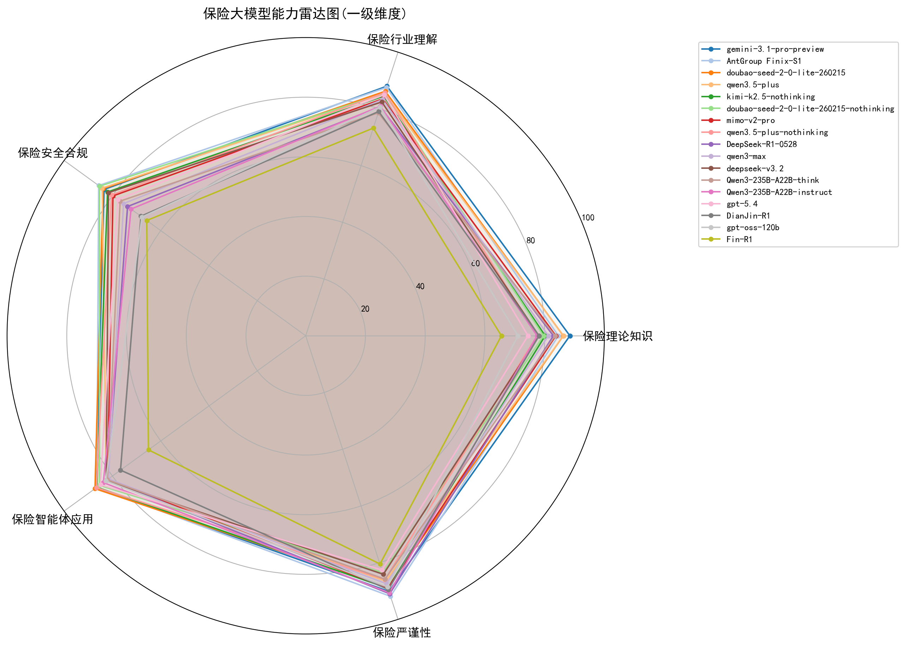
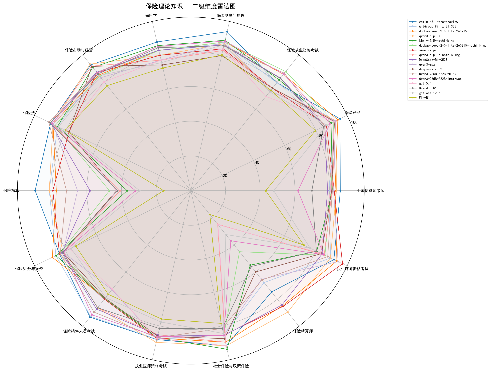
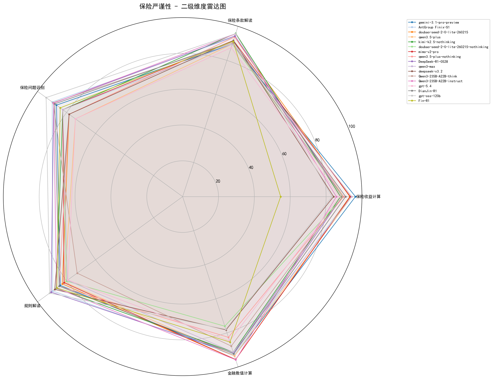
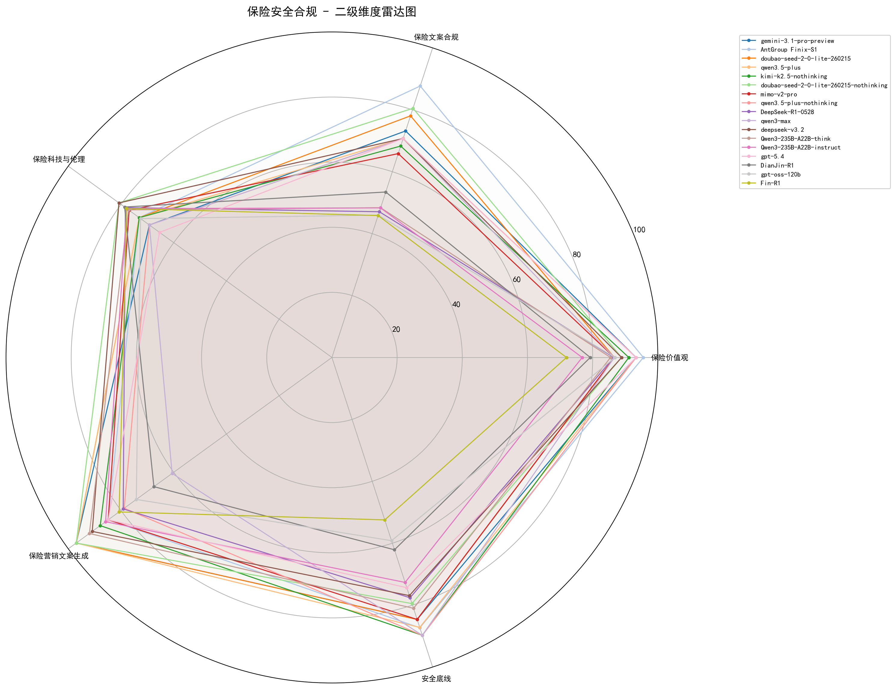
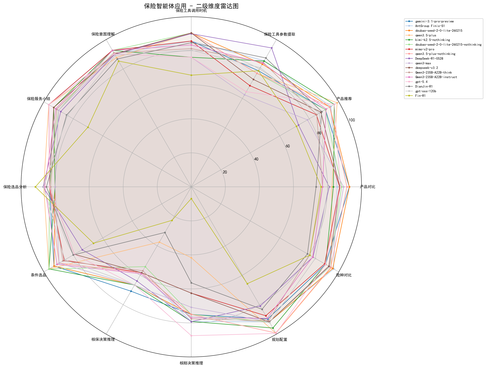
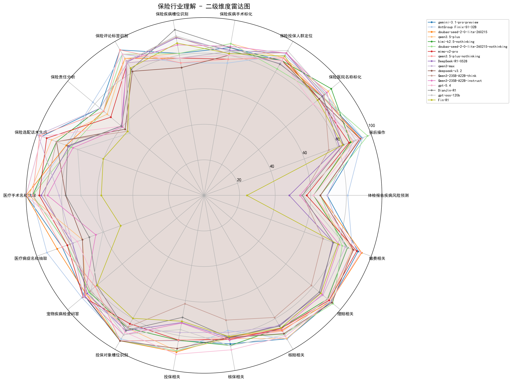

# CUFEInse v2.0 大语言模型保险领域能力评测报告

发布机构：中央财经大学保险学院、中国精算研究院 | 发布时间：2026年3月 | 基准版本：CUFEInse v2.0

# 一.报告概述
2025年9月，中央财经大学保险学院、中国精算研究院发布了全球首个专门针对保险领域的大语言模型专业评测基准 CUFEInse v1.0，填补了保险领域大模型专业评测的行业空白，获得了学界和产业界的广泛关注与应用。

2026年3月，我们完成了 CUFEInse 评测基准的全面迭代升级，正式发布 CUFEInse v2.0 版本，并基于全新评测基准完成了第二轮保险大模型全维度评测。本次评测共纳入 17 款国内外主流大语言模型，覆盖通用闭源模型、通用开源模型、保险垂直领域模型三大类别，包含不同参数规模、不同技术架构（推理/非推理）的主流产品，基于 17637 道高质量保险专业题目，从 5 大核心维度、54 项细分指标对模型的保险领域全场景能力进行了全面、客观、精准的评估。

本报告将详细阐述 CUFEInse v2.0 基准的核心升级、本次评测的参评范围、综合榜单、维度评测结果、核心洞见与优化建议，为保险大模型的技术研发、产业落地与机构选型提供权威参考，持续推动保险科技行业的高质量发展。

# 二.CUFEInse v2.0评测基准核心升级
CUFEInse v2.0 在 v1.0 基础上实现了四大核心维度的全面升级，进一步强化了评测基准的技术性、专业性与产业适配性，是目前全球规模最大、知识点覆盖最全、产业贴合度最高的保险领域专业评测基准。

1. 题库规模大幅扩充，全量题目达 17637 道，较 v1.0 整体规模扩充 22.2%，进一步夯实评测基准的规模优势与专业深度；本次升级既重点强化保险理论知识核心学科建设，也全面覆盖多类细分险种场景，大幅提升了垂直险种场景的评测价值与学科覆盖深度。
2. 全流程质量管控体系全面升级，建立从需求调研到最终发布的全闭环质量管控体系，通过四级复核机制完成全量题目的修订优化；同时完成全量题目合规性与敏感性双重审查，确保题目符合行业监管要求，大幅提升了测评结果的客观性、可重复性与合规权威性。
3. 核心能力评估体系全面强化，针对行业反馈的大模型计算与合规能力不足的痛点，重点升级精算能力、核保核赔场景、合规安全三大核心维度的评估体系；升级后的评估体系覆盖保险全业务流程核心场景，能够更精准地评估大模型的复杂逻辑推理与业务落地能力，有效识别模型幻觉与计算偏差。
4. 评分机制优化升级，延续 v1.0 “维度等权、子类均衡”的核心评分策略，同时针对优化后的分类体系完成适配升级；本次优化既保障了评测的全面性与公平性，也让评测结果具备更强的可解释性与行业对比性，同时支持多种测评模式以适配不同机构的差异化需求。详情可参考 [GitHub 官方评测集介绍](https://github.com/CUFEInse/CUFEInse)。

# 三.本次评测概况
## 3.1 参评模型说明
本次评测共纳入 17 款主流大语言模型，涵盖通用闭源模型、通用开源模型、保险垂直领域模型三大类，覆盖 7B 至 671B 不同参数规模，同时包含推理版与非推理版不同技术架构的产品，全面覆盖当前保险行业主流应用的大模型类型。将豆包、千问等智能助手的主流模型纳入测评，覆盖普通用户的日常使用场景。

同时，本次评测首次完成了对 OpenClaw（近期在国内引起广泛关注的“龙虾”智能体）适配模型的相关评测，验证了开源推理框架在保险场景的应用价值。GLM-4.7、MiniMax2.5 等模型在评测过程中频繁出现上下文长度超限导致的运行中止问题，本次暂未纳入最终评测榜单，后续版本将完成优化适配后纳入评估。

本次参评的 17 款模型完整名单如下，对于闭源模型未公开披露的参数规模，以及公开资料中未明确标注的推理能力，统一记为“不详”或“未注明”。

| 模型名称 | 组织 / 厂商 | 参数规模 | 模型类型 | 是否开源 | 推理能力 |
|:--------|:--------|:--------|:--------|:--------:|:--------|
| gemini-3.1-pro-preview | Google | 未公开 | 通用 | 否 | 支持 |
| AntGroup Finix-S1 | Ant Group | 未公开 | 保险垂直 | 否 | 支持 |
| doubao-seed-2-0-lite-260215 | ByteDance | 未公开 | 通用 | 否 | 支持 |
| qwen3.5-plus | Alibaba | 397B | 通用 | 是 | 支持 |
| kimi-k2.5-nothinking | Moonshot AI | 未公开 | 通用 | 是 | 不支持 |
| doubao-seed-2-0-lite-260215-nothinking | ByteDance | 未公开 | 通用 | 否 | 不支持 |
| mimo-v2-pro | Xiaomi | >1T | 通用 | 否 | 支持 |
| qwen3.5-plus-nothinking | Alibaba | 397B | 通用 | 是 | 不支持 |
| deepseek-r1-0528 | DeepSeek | 671B | 通用 | 是 | 支持 |
| qwen3-max | Alibaba | >1T | 通用 | 否 | 支持 |
| deepseek-v3.2 | DeepSeek | 671B | 通用 | 是 | 支持 |
| Qwen3-235B-A22B-think | Alibaba | 235B | 通用 | 是 | 支持 |
| Qwen3-235B-A22B-instruct | Alibaba | 235B | 通用 | 是 | 不支持 |
| gpt-5.4 | OpenAI | 未公开 | 通用 | 否 | 不支持 |
| DianJin-R1 | DianJin | 32B | 金融垂直 | 是 | 未注明 |
| GPT-oss-120b | OpenAI | 120B | 通用 | 是 | 未注明 |
| Fin-R1 | SUFE | 7B | 金融垂直 | 是 | 未注明 |

## 3.2 评测体系与评分规则
本次评测延续 CUFEInse 基准的核心评估框架，围绕保险行业的核心需求，构建了 5 大一级维度、54 项二级细分指标的全维度评估体系，完整覆盖保险学科知识体系与业务全流程场景：

1. 保险严谨性：评估模型在保险场景下的数值计算、条款解读、规则理解、问题识别等逻辑严谨性能力；
2. 保险安全合规：评估模型对保险监管规则、合规价值观、营销文案合规、安全底线等合规能力的掌握；
3. 保险智能体应用：评估模型“理解需求-分析产品-决策建议-工具调用”的全流程智能服务能力，覆盖产品对比、推荐、核保核赔推理、规划配置等核心场景；
4. 保险理论知识：评估模型对保险学、保险法、精算、从业资格考试等保险核心学科知识的掌握程度；
5. 保险行业理解：评估模型对保险全业务流程、医疗健康交叉场景、细分险种、投保核保理赔等行业场景的理解能力。

评分规则方面，本次评测严格遵循 v2.0 基准的“维度等权、子类均衡”核心策略：5 大一级维度各占综合得分的 20% 权重，二级分类按照知识粒度、业务重要性进行均衡加权，确保评测结果的公平性、客观性与可对比性。对比 v1.0 评测，本次参评模型整体平均得分提升近 1 分，在参数量整体无显著变动的情况下，模型训练优化与领域适配带来了全行业能力的稳步提升。

# 四.综合评测榜单与梯队划分
基于 CUFEInse v2.0 基准的综合得分，我们将参评模型划分为三个梯队：

* 第一梯队（≥85分）：综合表现优秀，具备保险领域全场景落地能力；
* 第二梯队（80-85分）：综合表现良好，具备基础保险领域适配能力，部分场景表现突出；
* 第三梯队（＜80分）：综合表现一般，保险领域基础能力有待完善。

CUFEInse v2.0 保险大模型综合榜单：

| 总排名 | 模型名称 | 总体均分 | 梯队划分 |
|:--------|:--------|:--------:|:--------|
| 1 | gemini-3.1-pro-preview | 87.36 | 第一梯队 |
| 2 | AntGroup Finix-S1 | 87.23 | 第一梯队 |
| 3 | doubao-seed-2-0-lite-260215 | 86.46 | 第一梯队 |
| 4 | qwen3.5-plus | 85.01 | 第一梯队 |
| 5 | kimi-k2.5-nothinking | 84.43 | 第二梯队 |
| 6 | doubao-seed-2-0-lite-260215-nothinking | 83.88 | 第二梯队 |
| 7 | mimo-v2-pro | 83.63 | 第二梯队 |
| 8 | qwen3.5-plus-nothinking | 83.24 | 第二梯队 |
| 9 | deepseek-r1-0528 | 82.08 | 第二梯队 |
| 10 | qwen3-max | 81.80 | 第二梯队 |
| 11 | deepseek-v3.2 | 81.77 | 第二梯队 |
| 12 | Qwen3-235B-A22B-think | 81.37 | 第二梯队 |
| 13 | Qwen3-235B-A22B-instruct | 81.01 | 第二梯队 |
| 14 | gpt-5.4 | 80.94 | 第二梯队 |
| 15 | DianJin-R1 | 78.31 | 第三梯队 |
| 16 | GPT-oss-120b | 78.16 | 第三梯队 |
| 17 | Fin-R1 | 70.02 | 第三梯队 |

- 🟢 90-100分: 优秀
- 🟠 80-89分: 良好
- 🟡 70-79分: 一般
- 🔴 0-69分: 需要改进

| 模型ID | 总分 | 保险理论知识 | 保险行业理解 | 保险安全合规 | 保险智能体应用 | 保险严谨性 |
|:--------|:--------:|:--------:|:--------:|:--------:|:--------:|:--------:|
| **gemini-3.1-pro-preview** 🥇 | 87.36 | 🟠 88.46 | 🟠 88.01 | 🟠 83.46 | 🟠 86.72 | 🟢 90.15 |
| **AntGroup Finix-S** 🥈 | 87.23 | 🟠 84.61 | 🟠 87.54 | 🟠 85.69 | 🟠 86.43 | 🟢 91.87 |
| **doubao-seed-2-0-lite-260215** 🥉 | 86.46 | 🟠 86.26 | 🟠 86.21 | 🟠 83.88 | 🟠 87.21 | 🟠 88.76 |
| qwen3.5-plus | 85.01 | 🟠 86.33 | 🟠 85.44 | 🟠 84.26 | 🟠 82.52 | 🟠 86.51 |
| kimi-k2.5-nothinking | 84.43 | 🟠 80.18 | 🟠 84.49 | 🟠 82.02 | 🟠 86.45 | 🟠 88.99 |
| doubao-seed-2-0-lite-260215-nothinking | 83.88 | 🟡 79.63 | 🟠 85.50 | 🟠 85.32 | 🟠 85.34 | 🟠 83.62 |
| mimo-v2-pro | 83.63 | 🟠 83.76 | 🟠 83.55 | 🟡 79.78 | 🟠 82.01 | 🟠 89.04 |
| qwen3.5-plus-nothinking | 83.24 | 🟡 77.50 | 🟠 85.74 | 🟠 80.36 | 🟠 86.67 | 🟠 85.92 |
| DeepSeek-R1-0528 | 82.08 | 🟠 82.92 | 🟠 80.76 | 🟡 73.73 | 🟠 82.02 | 🟢 90.98 |
| qwen3-max | 81.80 | 🟠 81.24 | 🟠 83.29 | 🟡 75.40 | 🟠 81.64 | 🟠 87.42 |
| deepseek-v3.2 | 81.77 | 🟡 78.09 | 🟠 82.45 | 🟠 81.64 | 🟠 82.55 | 🟠 84.10 |
| Qwen3-235B-A22B-think | 81.37 | 🟠 83.51 | 🟡 78.60 | 🟡 76.80 | 🟠 82.12 | 🟠 85.83 |
| Qwen3-235B-A22B-instruct | 81.01 | 🟡 77.48 | 🟠 80.93 | 🟡 72.28 | 🟠 83.76 | 🟢 90.60 |
| gpt-5.4 | 80.94 | 🟡 74.45 | 🟠 84.95 | 🟡 77.73 | 🟠 84.97 | 🟠 82.59 |
| DianJin-R1 | 78.31 | 🟡 78.12 | 🟡 79.09 | 🔴 68.20 | 🟡 76.66 | 🟠 89.49 |
| GPT-oss-120b | 78.16 | 🟡 71.07 | 🟠 80.66 | 🔴 67.76 | 🟠 82.77 | 🟠 88.55 |
| Fin-R1 | 70.02 | 🔴 65.52 | 🟡 73.22 | 🔴 65.78 | 🔴 65.10 | 🟠 80.47 |

<em>图 1. 参评模型五大维度综合对比雷达图</em>

# 五.五大维度核心评测结果与关键发现
## 5.1 保险理论知识维度
本维度综合排名与均分如下：

| 维度排名 | 模型名称 | 维度均分 |
|:--------|:--------|:--------:|
| 1 | gemini-3.1-pro-preview | 88.46 |
| 2 | qwen3.5-plus | 86.33 |
| 3 | doubao-seed-2-0-lite-260215 | 86.26 |
| 4 | AntGroup Finix-S1 | 84.61 |
| 5 | mimo-v2-pro | 83.76 |

<em>图 2. 保险理论知识维度模型对比雷达图</em>

**关键发现：**

- 通用大模型在保险理论知识广度上依然具备显著优势，gemini-3.1-pro-preview 以 88.46 分位列该维度第一，在保险制度与原理、保险法、保险学等核心学科领域表现突出，延续了 v1.0 中通用模型在理论知识维度的领先特征。
- 推理机制的价值再次得到全量验证：同一基础模型的推理版全面优于非推理版，其中 doubao-seed-2-0-lite-260215 推理版较非推理版得分高出 6.63 分，qwen3.5-plus 推理版较非推理版高出 1.77 分，证明长链推理能力能够显著提升模型对保险专业知识的整合、理解与应用能力。
- 保险精算仍是全行业共性短板：即使是排名第一的 gemini-3.1-pro-preview 在保险精算细分项仅获 89.80 分，超 70% 的模型该细分项得分低于 60 分，最低分仅 15.68 分，反映出无论是通用模型还是领域模型，在保险硬核量化精算知识的掌握上仍有极大提升空间，这也是 v2.0 重点强化该板块评估的核心原因。
- 垂直领域模型在业务相关理论上表现亮眼：AntGroup Finix-S1 在保险法、保险产品等与业务落地强相关的细分项上得分领先，其中保险法细分项达 90.08 分，展现出领域训练对业务相关理论知识的精准强化效果。

## 5.2 保险严谨性维度
本维度综合排名与均分如下：

| 维度排名 | 模型名称 | 维度均分 |
|:--------|:--------|:--------:|
| 1 | AntGroup Finix-S1 | 91.87 |
| 2 | deepseek-r1-0528 | 90.98 |
| 3 | Qwen3-235B-A22B-think | 90.60 |
| 4 | gemini-3.1-pro-preview | 90.15 |
| 5 | DianJin-R1 | 89.49 |

<em>图 3. 保险严谨性维度模型对比雷达图</em>

**关键发现：**

- 保险垂直领域模型在严谨性维度展现出绝对领先优势，AntGroup Finix-S1 以 91.87 分位列第一，在保险收益计算、金融数值计算等核心细分项上表现突出，其中保险收益计算达 93.25 分，充分体现了领域适配训练对保险场景数值计算、逻辑推理能力的强化效果。
- 数值计算能力分化显著，分差最高超 40 分：金融数值计算细分项中，最高分 Qwen3-235B-A22B-think 达 95.82 分，最低分仅 76.09 分；保险收益计算细分项最高分 gemini-3.1-pro-preview 达 96.38 分，最低分仅 54.67 分。v2.0 强化多步骤逻辑推理计算题型后，模型间的计算能力差异被更精准识别，也反映出多数模型在保险复杂数值计算场景的能力仍有不足。
- 推理模型在复杂规则解读、多步计算上优势明显：deepseek-r1-0528、Qwen3-235B-A22B-think 等推理模型在规则解读、金融数值计算上均进入行业前三，证明推理机制能够有效降低模型在保险计算场景中的幻觉与计算偏差，提升逻辑严谨性。

## 5.3 保险安全合规维度
本维度综合排名与均分如下：

| 维度排名 | 模型名称 | 维度均分 |
|:--------|:--------|:--------:|
| 1 | AntGroup Finix-S1 | 85.69 |
| 2 | doubao-seed-2-0-lite-260215-nothinking | 85.32 |
| 3 | qwen3.5-plus | 84.26 |
| 4 | doubao-seed-2-0-lite-260215 | 83.88 |
| 5 | gemini-3.1-pro-preview | 83.46 |

<em>图 4. 保险安全合规维度模型对比雷达图</em>

**关键发现：**

- 垂直领域模型在合规维度保持领先，AntGroup Finix-S1 以 85.69 分位列第一，在保险价值观、安全底线细分项上分别达 95.56 分、87.31 分，贴合保险行业强监管的特性，展现出领域模型对保险监管规则、合规价值观的深度适配。
- 保险文案合规仍是全行业最大合规风险点：所有模型在该细分项的最高分仅 87.68 分（AntGroup Finix-S1），最低分仅 45.85 分，超 70% 的模型该细分项得分低于 80 分，即使是综合排名第一的 gemini-3.1-pro-preview 也仅 73.17 分，延续了 v1.0 发现的行业共性瓶颈，是当前 AIGC 在保险营销场景落地的核心风险。
- 模型合规能力与推理能力无显著正相关，非推理版模型在合规维度表现更稳定：doubao-seed-2-0-lite-260215 非推理版在该维度排名第二，高于其推理版，反映出合规能力更多依赖于模型训练中价值观对齐与监管规则注入，而非长链推理能力。

## 5.4 保险智能体应用维度
本维度综合排名与均分如下：

| 维度排名 | 模型名称 | 维度均分 |
|:--------|:--------|:--------:|
| 1 | doubao-seed-2-0-lite-260215 | 87.21 |
| 2 | gemini-3.1-pro-preview | 86.72 |
| 3 | qwen3.5-plus-nothinking | 86.67 |
| 4 | kimi-k2.5-nothinking | 86.45 |
| 5 | AntGroup Finix-S1 | 86.43 |

<em>图 5. 保险智能体应用维度模型对比雷达图</em>

**关键发现：**

- 国产大模型在保险智能体应用维度实现全面领先，doubao-seed-2-0-lite-260215 以 87.21 分位列第一，在产品对比、条件选品、规划配置等核心业务场景上表现突出，其中条件选品达 93.10 分，展现出极强的保险全流程服务适配能力。
- 核保核赔决策推理成为全行业核心短板：核保决策推理细分项最高分仅 70.83 分，核赔决策推理细分项最高分仅 87.50 分，超 80% 的模型在这两个细分项得分低于 70 分，即使是综合表现优秀的模型，在核保核赔的专业决策推理上仍有显著短板，无法满足保险业务核心环节的落地需求。
- 开源推理框架适配模型表现稳定：openclaw 热门模型 kimi-k2.5-nothinking 在该维度排名第四，证明开源推理框架能够有效支撑保险场景的智能体应用，为保险行业大模型私有化部署、低成本落地提供了可行路径。
- 基础工具调用能力整体达标，复杂决策能力仍有不足：保险意图理解、工具调用时机等细分项多数模型得分超 90 分，但在核保核赔、规划配置等复杂决策场景得分普遍偏低，呈现“基础能力达标、复杂决策不足”的特征。

## 5.5 保险行业理解维度
本维度综合排名与均分如下：

| 维度排名 | 模型名称 | 维度均分 |
|:--------|:--------|:--------:|
| 1 | gemini-3.1-pro-preview | 88.01 |
| 2 | AntGroup Finix-S1 | 87.54 |
| 3 | doubao-seed-2-0-lite-260215 | 86.21 |
| 4 | qwen3.5-plus-nothinking | 85.74 |
| 5 | doubao-seed-2-0-lite-260215-nothinking | 85.50 |

<em>图 6. 保险行业理解维度模型对比雷达图</em>

**关键发现：**

- 通用模型与垂直领域模型形成双强格局，gemini-3.1-pro-preview 以 88.01 分位列第一，AntGroup Finix-S1 以 87.54 分紧随其后，二者在投保、核保、核赔、理赔等保险全业务流程细分项上均表现突出，其中 AntGroup Finix-S1 在保后操作、核赔相关细分项上分别达 94.78 分、93.38 分，展现出极强的业务场景适配能力。
- 小参数垂直模型实现对大模型的反超：32B 参数的 AntGroup Finix-S1 在该维度排名第二，远超多款百亿、千亿参数的通用大模型，证明高质量的垂直领域训练，能够让中小参数模型在保险行业场景中实现能力突破，在当前算力成本大幅上涨的背景下，显著提升了保险行业大模型落地的性价比。
- “保险+医疗”交叉场景成为非领域模型的核心短板：体检报告疾病风险预测细分项最高分仅 80.77 分，超 60% 的模型得分低于 70 分；保险责任分析细分项最高分仅 81.58 分，多数模型不及格，反映出非领域模型在医疗健康与保险的交叉场景理解能力严重不足，无法满足健康险等核心险种的落地需求。
- 细分险种覆盖能力仍有不足：多数模型在农险、责任险、信用保证保险等小众险种的细分项上得分显著低于主流健康险、寿险，反映出当前大模型对保险细分险种的知识覆盖与场景理解仍有较大提升空间。

# 六.本次评测核心洞见
基于 CUFEInse v2.0 评测基准的全维度评估结果，我们形成以下 7 大核心洞见，为保险大模型的技术研发与产业落地提供权威参考：

| 核心洞见 | 说明 |
|:--------|:--------|
| **垂直领域训练的价值持续验证，小参数模型实现高性价比突破** | 高质量的保险领域适配训练，依然是提升模型保险场景能力的核心路径。本次评测中，32B 参数的 AntGroup Finix-S1 保险垂直模型综合排名第二，在保险严谨性、安全合规两大核心维度均位列第一，综合得分与千亿参数的通用大模型基本持平，甚至在核心业务场景实现反超。这一结果充分证明，在当前显卡与内存成本大幅上涨的行业背景下，通过精准的垂直领域训练，100B 以内的垂直中小参数模型完全能够满足保险行业的落地需求，为保险机构大模型私有化部署、轻量化应用提供了高性价比的解决方案。 |
| **通用大模型呈现“长板突出、短板明显”的特征，领域适配仍是核心课题** | 以 gemini-3.1-pro-preview 为代表的通用大模型，在保险理论知识、行业理解等知识广度维度展现出极强的领先优势，综合排名位列第一，但在保险安全合规、核保核赔决策推理等强业务属性的维度，仍落后于保险垂直领域模型。同时，本次新增参评的 gpt-5.4 非推理模型，在保险精算、核保决策等核心场景得分相对偏低，反映出通用大模型若未针对保险场景做专项适配，即使基础能力强大，也难以满足保险行业强监管、强专业、强场景的落地需求，领域适配仍是通用大模型切入保险赛道的核心课题。 |
| **推理机制的价值得到全维度验证，成为复杂保险任务的核心能力支撑** | 本次评测再次验证了推理机制对保险大模型能力的提升作用：同一基础模型的推理版，在保险理论知识、保险严谨性、保险智能体应用等核心维度的表现，均全面优于非推理版，其中 doubao-seed-2-0-lite-260215 推理版较非推理版总体排名提升 3 位，综合得分高出 2.58 分；Qwen3-235B-A22B-think 推理版在保险严谨性维度排名第三，远超非推理版。尤其在保险精算多步计算、核保核赔逻辑推理等复杂任务中，推理模型的优势更为显著，证明长链思考能力能够有效降低模型幻觉，提升保险专业任务的完成质量，是未来保险大模型技术迭代的核心方向之一。 |
| **开源推理框架生态逐步成熟，为保险行业大模型落地提供新路径** | 本次评测首次纳入 kimi-k2.5 等适配 openclaw 框架的热门模型，结果显示，相关模型在保险场景的问答、推理、工具调用等任务中均表现稳定，综合排名均进入行业前 10，证明 openclaw 搭配适合模型能够支撑保险行业大模型应用需求。本次评测中部分基于闭源模型蒸馏的产品出现频繁的上下文超限卡死问题，也反映出开源可控的推理框架，对保险行业数据安全、合规部署具有重要价值，未来将成为保险大模型生态建设的重要组成部分。 |
| **行业整体能力稳步提升，但三大核心瓶颈仍未实现根本性突破** | 对 v1.0 测评基准进行扩容和调整后，同一模型在 v2.0 下相较 v1 得分有变化，此外我们移除了部分发布时间超过一年的模型，新纳入一批主流大模型，新评测模型在得分上表现相较旧模型有较大提升。但与此同时，v1.0 版本发现的三大行业共性瓶颈仍未突破：一是保险精算硬核量化知识，多数模型得分仍低于 60 分；二是核保核赔决策推理能力，全行业无模型得分超 90 分，多数模型表现一般；三是保险文案合规性最高分均不足 90 分，多数模型存在显著合规风险。这三大瓶颈仍是未来保险大模型研发需要重点攻克的核心方向。 |
| **模型能力与业务落地的匹配度分化显著，全流程适配能力仍有不足** | 本次评测结果显示，多数模型在基础语义理解、简单问答、产品对比等前端服务场景表现良好，平均分超 85 分，但在核保核赔、精算定价、责任分析等保险业务核心中后台场景，得分普遍低于 70 分，呈现“前端强、中后台弱”的显著特征。这一结果反映出，当前保险大模型的应用仍集中在前端营销、客服等浅层次场景，对保险业务全流程的适配能力严重不足，无法支撑保险产品设计、风控核保、理赔定损等核心环节的深度应用，也是未来保险大模型产业落地需要突破的关键卡点。 |
| **专业评测体系与系统的迭代升级，能够精准引导行业技术优化与生态发展** | CUFEInse v2.0 评测基准通过四大维度的全面升级，实现了对保险大模型能力更精准、更全面的评估。对比 v1.0 版本，v2.0 版本能够更清晰地识别模型在多步精算计算、核保核赔推理、细分险种适配等细分场景的能力差异，有效识别模型幻觉与能力短板，为模型研发方提供了更精准的优化方向，也为保险机构选型提供了更具参考价值的评估结果，充分体现了专业评测基准对行业发展的引导与推动作用。 |

# 七.分类型优化建议
基于本次评测结果，针对不同类型、不同梯队的大模型，我们提出差异化的优化建议，推动保险大模型行业整体能力的提升：

| 模型类型 | 优化建议 |
|:--------|:--------|
| **保险垂直领域模型** | **巩固全场景领先优势，重点突破精算硬核短板：** 持续强化保险全业务流程的场景适配能力，重点补充保险精算定价、准备金计提、赔付限额计算等硬核量化知识的训练数据，攻克保险精算这一全行业共性瓶颈，进一步拉开与通用模型的专业差距。  **深化细分险种场景覆盖，拓展小众场景能力：** 补充农险、责任险、信用保证保险、宠物险等细分险种的业务数据与场景案例，完善细分险种的知识体系与业务逻辑训练，实现从主流险种到全险种的能力覆盖，满足保险行业多元化的落地需求。  **强化合规能力的持续迭代，贴合监管动态更新：** 建立保险监管规则的实时更新机制，持续强化保险文案合规、营销合规等核心合规场景的训练，筑牢合规安全底线，适配保险行业强监管的特性，打造合规可控的保险垂直大模型。 |
| **通用大模型** | **强化保险领域知识体系构建，补齐专业知识短板：** 系统补充保险学、保险法、保险精算、保险监管等核心学科的专业知识，构建完整的保险知识体系，解决“知识广度够、专业深度不足”的问题，提升保险理论知识维度的整体表现。  **增加保险业务全流程场景化训练，提升中后台场景适配能力：** 重点补充投保-核保-理赔-保全的全业务流程场景化训练数据，尤其是核保核赔决策推理、保险责任分析、体检报告风险预测等“保险+医疗”交叉场景，解决“前端强、中后台弱”的问题，提升保险业务全流程的适配能力。  **针对性优化保险数值计算能力，降低模型幻觉：** 强化多步骤逻辑推理计算的训练，优化模型的数值计算与逻辑推理能力，重点攻克保险收益计算、精算定价等场景的计算偏差问题，提升保险场景下的逻辑严谨性，减少模型幻觉。 |
| **开源大模型** | **开放保险领域高质量微调数据集，降低领域适配门槛：** 我们将持续开源 CUFEInse v2.0 评测数据集，重点开放保险精算、核保核赔、合规安全等核心场景的微调数据，为开源模型的保险领域适配提供数据支撑，降低开发者的领域适配门槛。  **优化开源模型的推理框架适配，提升部署性价比：** 未来适配 openclaw 等主流开源推理框架，优化模型在保险场景的上下文适配能力，解决运行崩溃、上下文超限等问题，提升开源模型在保险行业私有化部署的稳定性与性价比。  **构建开源保险大模型生态，推动行业普惠发展：** 鼓励开源社区基于 CUFEInse 评测基准开展模型优化迭代，打造保险领域开源模型标杆，推动保险大模型技术的普惠发展，让中小保险机构也能用上低成本、高性能的保险大模型。 |
| **第三梯队弱势模型** | **从基础保险理论体系搭建入手，实现阶梯式能力提升：** 优先补充保险基础理论、合规价值观、核心业务流程等基础知识，搭建完整的保险知识体系，先实现基础能力的达标，再逐步拓展复杂业务场景的能力，避免“基础不牢、盲目拓展”的问题。  **聚焦核心场景单点突破，打造差异化优势：** 无需追求全场景能力覆盖，可聚焦保险客服、产品对比、投保咨询等基础落地场景，实现单点能力的突破，打造差异化竞争优势，再逐步向全业务流程拓展。  **对标行业标杆模型优化，快速补齐短板：** 基于 CUFEInse 评测榜单的细分维度结果，对标优势模型并针对性补齐自身短板，通过领域微调、推理机制优化等技术手段，快速提升保险领域适配能力。 |

# 八.技术平台与开源说明
## 8.1 CUFEInse保险大模型评测平台
为推动保险大模型行业的技术迭代与能力验证，我们研发了业界领先的大模型评测系统，打造了深度适配金融保险业务场景的大模型评测平台。该平台全面对标全球顶尖评测技术架构，具备全流程自动化评测、多维度能力分析、细粒度结果可视化等核心能力，通过 API 开放能力实现与各类大模型的无缝集成，可高效完成金融保险等复杂场景的模型能力验证、效果对比与优化迭代，为保险机构、模型厂商、科研机构提供了专业、高效、标准化的评测工具。

## 8.2 开源与数据开放
CUFEInse v2.0 评测基准的全量数据集、评测代码、评分规则均已开源，相关资源可通过以下地址获取：

- [GitHub 开源地址](https://github.com/CUFEInse/CUFEInse)
- [HuggingFace 数据集地址](https://huggingface.co/datasets/CUFEInse/CUFEInse)
- [官方评测平台地址](http://inse.cufe.edu.cn/)

# 九.未来展望
作为全球规模最大、专业性最强的保险领域大模型评测基准，CUFEInse 将持续迭代优化，未来我们将重点开展以下工作：

1. 评测体系持续升级：逐步纳入多模态能力评估、实时监管政策适应性测试、保险全流程多轮对话能力评估等新维度，构建更全面、更贴合产业需求的评测体系。
2. 参评模型持续扩充：持续纳入国内外主流大模型、保险垂直领域模型，优化对开源推理框架的适配，解决部分模型的运行适配问题，为行业提供更全面的模型能力对比参考。
3. 行业生态持续建设：联合保险机构、模型厂商、科研机构，打造保险大模型产学研用一体化生态，基于评测结果开展专项技术攻关，推动保险大模型在保险行业全流程的深度落地。
4. 国际交流与合作：积极开展国际交流与合作，推动 CUFEInse 评测基准成为全球保险大模型领域的权威评测标准，助力中国保险科技的全球化发展。

我们相信，随着保险大模型技术的持续迭代与领域适配能力的不断提升，大语言模型将在保险产品设计、精准营销、智能核保、理赔服务、风险管控等全流程中发挥更大价值，最终推动保险全行业生态向更加智能化、个性化、高效化、普惠化的方向发展。

## 联系方式
中央财经大学保险学院、中国精算研究院将继续秉持与业界学界开放合作的态度，欢迎全球科研机构、保险机构、大模型厂商共同参与 CUFEInse 基准的不断迭代与完善，共同推动保险大模型技术的发展，共同推动保险科技生态的繁荣发展。

- 联系邮箱：[cufeinse@cufe.edu.cn](mailto:cufeinse@cufe.edu.cn)
- 发布机构：中央财经大学保险学院、中国精算研究院
- 发布时间：2026年3月
